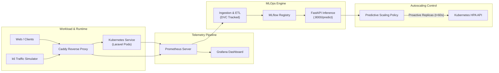

# Predictive Autoscaling MLOps

[](https://www.python.org/downloads/)
[](https://kubernetes.io/)
[](https://github.com/features/codespaces)
[](LICENSE)
[](https://github.com/astral-sh/ruff)
[](tests/)

> A cloud-native MLOps platform for time-series workload forecasting and proactive autoscaling in Kubernetes.

---

## 📌 The Problem: Reactive Autoscaling Lag

Standard Kubernetes **Horizontal Pod Autoscaler (HPA)** is reactive: it triggers pod scaling only *after* resource utilization (e.g. CPU > 60%) or traffic thresholds have already been exceeded.

In production containerized services:
1. **Container Bootstrap Latency:** Pulling images, booting runtimes, and running framework initializations takes **30 to 90 seconds (observed mean ~45s)**.
2. **SLO Violations:** During traffic surges (*spikes* or *flash crowds*), pods become saturated before new replicas can transition to `Ready`, causing sharp latency spikes ($p_{95} > 120\text{ms}$) and dropped connections.
3. **Flapping & Inefficiency:** Reactive thresholds often oscillate during volatile traffic conditions, causing unnecessary resource churn.

**The Solution:** This project bridges Machine Learning and Cloud-Native Operations to forecast incoming request rate **60 seconds into the future**, allowing Kubernetes to provision pod replicas *proactively before latency degrades*.

---

## 🏗️ System Architecture



---

## ✨ Key Features

- **Empirically-Grounded Horizon:** Horizon length of **60 seconds (4 steps @ 15s)** was derived directly from measured HPA scale-up lag on a live multi-node Kubernetes cluster.
- **Continuous Telemetry (Not Mock Data):** Ingests real metrics via Prometheus HTTP API (`request_rate`, `php_cpu_cores`, `php_memory_bytes`, `replicas`, `p95_latency`).
- **Data Versioning & Lineage:** Integrated with **DVC (Data Version Control)** backed by S3/MinIO remote storage (`storage.titipin.me/mlops-dvc`).
- **Reproducible Dev Environment:** Preconfigured **GitHub Codespaces** (`.devcontainer`) with exact pinned dependencies, pytest smoke tests, and linting.
- **End-to-End Governance:** Multi-stage quality gates (`tests/test_dataset.py`), strict chronological train/val/test splits (70/15/15), and model lifecycle management via **MLflow**.
- **Observability Stack:** Live dashboards in Grafana monitoring actual vs. predicted workload, scaling responsiveness, and data drift.

---

## 🚀 Quickstart

### Option 1: One-Click Development with GitHub Codespaces

1. Open this repository on GitHub.
2. Click **Code → Codespaces → Create codespace on main**.
3. Wait for the dev container to finish initializing.
4. Validate the environment:
   ```bash
   python --version       # Python 3.12.x
   pytest -q              # 8 smoke tests passed
   ruff check .           # All checks passed
   ```
5. Open and run [`notebooks/01_initial_eda.ipynb`](notebooks/01_initial_eda.ipynb) against the committed dataset.

### Option 2: Local Setup

```bash
# 1. Clone repository
git clone https://github.com/oktavsm/predictive-autoscaling-mlops.git
cd predictive-autoscaling-mlops

# 2. Setup virtual environment
python3.12 -m venv .venv
source .venv/bin/activate

# 3. Install pinned dependencies
pip install --upgrade pip
pip install -r requirements-dev.txt

# 4. Verify test suite and code style
pytest -q
ruff check .
```

### Option 3: Run Workload & Telemetry Ingestion

```bash
# Execute automated load sequence (steady, spike, periodic, gradual)
bash scripts/run_workload_sequence.sh

# Export observed metrics window from Prometheus
python scripts/export_dataset.py \
  --start "2026-09-11T08:30:00Z" \
  --end "2026-09-11T09:30:00Z" \
  --output src/data/raw/new_session.csv
```

---

## 📁 Repository Structure

```text
predictive-autoscaling-mlops/
├── .devcontainer/              # Reproducible GitHub Codespaces environment
├── .github/workflows/          # CI/CD pipelines (testing, linting, automation)
├── api/                        # Model Serving & Inference REST API (FastAPI)
├── configs/                    # System, exporter, and Grafana dashboard configs
├── data/                       # DVC-managed datasets (raw, interim, processed)
├── docs/                       # Comprehensive technical documentation & guides
│   └── images/                 # Architecture diagrams and calibration graphs
├── infrastructure/             # Infrastructure-as-Code (Kubernetes, Docker, Monitoring)
│   ├── demo/                   # Demo frontend compose setup (port 3000)
│   ├── docker/                 # Production Dockerfiles & Compose definitions
│   ├── kubernetes/             # K3s manifests (Deployments, StatefulSets, HPA)
│   └── monitoring/             # Prometheus rules, ServiceMonitors, Alertmanager
├── notebooks/                  # Interactive EDA, feature correlation, and analysis
├── pipelines/                  # Automated pipeline stage definitions (ingestion, training, CT)
├── scripts/                    # Utility scripts (exporter, merge, k6 runners)
├── src/                        # Core Python application modules
│   ├── data/                   # Ingestion logic, dataset validation, data loaders
│   ├── features/               # Feature engineering (lags, rolling stats, deltas)
│   ├── models/                 # Model definitions, training logic, baseline predictors
│   ├── inference/              # Production model loading & prediction engine
│   └── scaling/                # Predictive autoscaling policy & pod recommendation
├── tests/                      # Automated quality gates and unit tests (pytest)
└── workloads/                  # Synthetic workload generation scenarios (k6 scripts)
```

---

## 🛠️ Technology Stack

| Domain | Tools / Technologies |
|---|---|
| **Target Application** | PHP Laravel (API Backend), React (Web Client) |
| **Container & Orchestration** | Docker, Kubernetes (K3s), Horizontal Pod Autoscaler (HPA) |
| **Telemetry & Observability** | Prometheus, Grafana, cAdvisor, kube-state-metrics |
| **Load Testing** | Grafana k6 (HTTP API Scenarios) |
| **Data Versioning** | DVC (Data Version Control), MinIO Object Storage (S3-compatible) |
| **Experiment Tracking** | MLflow Tracking & Model Registry |
| **Model Serving** | FastAPI, Uvicorn |
| **Language & Testing** | Python 3.12, scikit-learn, pandas, pytest, ruff |
| **CI/CD & Dev Environment** | GitHub Actions, GitHub Codespaces (Dev Containers) |

---

## 📖 Documentation Index

- **[System Architecture](docs/ARCHITECTURE.md):** Detailed component relationships, data flow, and scaling loops.
- **[Data Pipeline Design](docs/DATA_PIPELINE.md):** Prometheus query parameters, ETL stages, and feature definitions.
- **[Infrastructure Setup Guide](docs/SETUP_GUIDE.md):** Step-by-step guide for deploying K3s, monitoring, and backend services.
- **[Workload Generation Guide](docs/WORKLOAD_GENERATION.md):** k6 benchmark scenarios (steady, spike, gradual, periodic).
- **[Codespace Setup Guide](docs/CODESPACE_SETUP.md):** Development workflow and port forwarding guide.
- **[Architecture Decision Records](docs/DECISIONS.md):** Log of major technical decisions and trade-offs.

---

## 📄 License

This project is licensed under the MIT License - see the [LICENSE](LICENSE) file for details.
