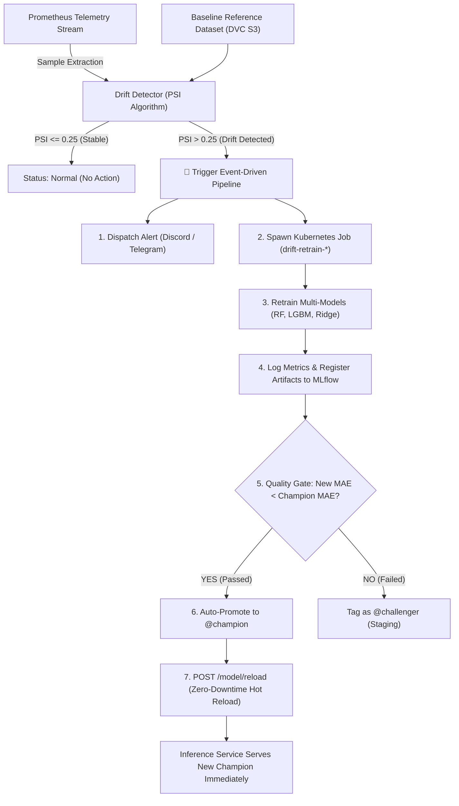

# 🔄 Panduan Closed-Loop Event-Driven Drift Retraining (LK-12)
## Level 2 MLOps Maturity: Autonomous Self-Healing Pipeline

Dokumen ini menjelaskan rancangan arsitektur, algoritma evaluasi drift Population Stability Index (PSI), pemicuan otomatis (*event-driven triggering*), gerbang evaluasi model (*evaluation gate*), dan *zero-downtime hot reload* pada sistem MLOps produksi.

---

## 🎯 1. Konsep Inti: Autonomous Self-Healing MLOps

Sebagian besar implementasi MLOps dasar hanya menjalankan *scheduled retraining* (misal via CronJob harian). Namun jika terjadi *Flash-Sale*, perubahan pola belanja pengguna (*concept drift*), atau lonjakan anomali di siang hari, model akan usang (*stale*) dan menghasilkan rekomendasi scaling yang keliru hingga jadwal retraining malam tiba.

Sistem **Predictive Autoscaling MLOps** ini mengimplementasikan **Closed-Loop Event-Driven Retraining**:



---

## 🧮 2. Metodologi Perhitungan Data Drift (PSI)

Algoritma Population Stability Index (PSI) membandingkan distribusi frekuensi data aktual terhadap data referensi acuan:

$$\text{PSI} = \sum_{b=1}^{B} \left( P_{\text{actual}}(b) - P_{\text{expected}}(b) \right) \times \ln\left( \frac{P_{\text{actual}}(b)}{P_{\text{expected}}(b)} \right)$$

### Ambang Batas Operasional (*Standard Thresholds*):
* $\text{PSI} < 0.10$: **No Shift** — Distribusi stabil, model beroperasi optimal.
* $0.10 \le \text{PSI} \le 0.25$: **Moderate Shift** — Terjadi perubahan ringan, masuk dalam radar pemantauan.
* $\text{PSI} > 0.25$: **Severe Shift (Action Required)** — Perubahan distribusi mayor; secara otomatis memicu eksekusi *retraining Job*.

---

## 🚀 3. Eksekusi Engine Retraining Mandiri

Engine otonom berada di [`src/pipeline/autonomous_drift_retrain.py`](file:///home/oktaavsm/Code/github.com/college/predictive-autoscaling-mlops/src/pipeline/autonomous_drift_retrain.py) dan dapat dijalankan secara langsung:

```bash
python3 src/pipeline/autonomous_drift_retrain.py --threshold 0.25
```

### Opsi Parameter:
* `--ref-file`: Berkas acuan dasar (default: `src/data/raw/spike_run_001.csv`).
* `--curr-file`: Berkas data telemetri terkini (default: `src/data/raw/periodic_run_001.csv`).
* `--threshold`: Nilai batas toleransi PSI (default: `0.25`).
* `--force-retrain`: Memaksa pemicuan retraining tanpa menunggu drift terdeteksi (cocok untuk demonstrasi live LK-14).
* `--output-json`: Lokasi penyimpanan rekam jejak eksekusi (`docs/coursework/AUTONOMOUS_DRIFT_REPORT.json`).

---

## ⚡ 4. Mekanisme Zero-Downtime Hot Reload

Salah satu keunggulan teknis utama arsitektur ini adalah **ketiadaan kebutuhan merestart pod inferensi**:
1. Setelah model baru dilatih dan dievaluasi lebih unggul, model tersebut diberi alias `@champion` pada MLflow Model Registry.
2. Engine mengirimkan payload ke endpoint produksi:
   ```bash
   curl -X POST https://model.titipin.me/model/reload -H "Content-Type: application/json" -d "{}"
   ```
3. Kontainer `inference-api` memuat bobot model baru langsung ke dalam memori RAM Python worker dan mengembalikan status:
   ```json
   {
     "status": "reloaded",
     "model": "predictive-autoscaler",
     "model_alias": "champion",
     "load_time_ms": 14.2
   }
   ```
4. Pod tidak mengalami restart (`Restarts: 0`), sesi klien tidak terputus, dan prediksi siklus berikutnya langsung menggunakan model teranyar.

---

## 🎓 5. Nilai Tambah Akademis untuk Lembar Kerja (LK-12)

* **Google MLOps Maturity Level 2:** Memenuhi seluruh prasyarat otomasi pipeline: *Continuous Integration* (test data), *Continuous Delivery* (model registry), dan *Continuous Training* (drift-triggered execution).
* **Closed-Loop Feedback:** Menghilangkan ketergantungan pada intervensi manusia untuk menjaga akurasi model di lingkungan produksi yang dinamis.
