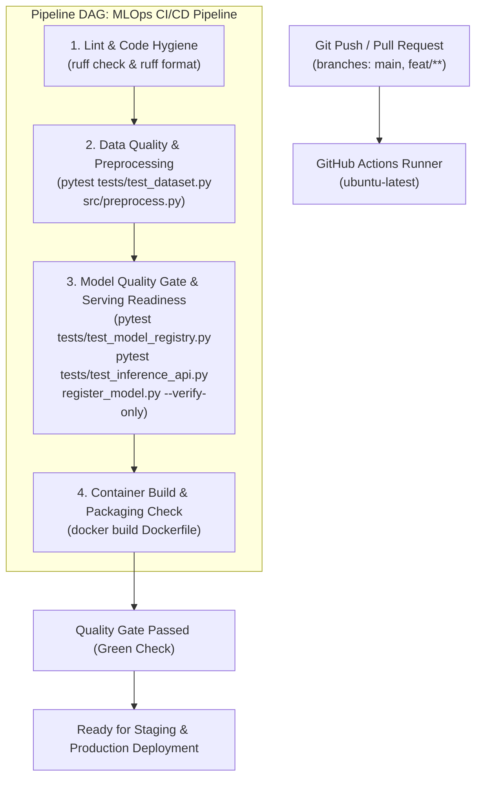

# Continuous Integration & Delivery (CI/CD) Pipeline
> **Automation Engine:** GitHub Actions (`.github/workflows/mlops-ci.yaml`)  
> **Workflow Pattern:** Multi-Stage Directed Acyclic Graph (DAG)  
> **Trigger Strategy:** Push and Pull Request (`main`, `feat/**`)  

---

## 1. Arsitektur Pipeline CI/CD MLOps

Pipeline CI/CD dirancang untuk menjamin integritas mutu kode, validasi skema data telemetri, penegakan ambang batas kualitas model (*model evaluation gate*), serta verifikasi kesiapan paket kontainer sebelum kode digabungkan (*merge*) ke cabang utama (`main`).



---

## 2. Rincian Tahapan Pekerjaan (*Jobs Specification*)

Konfigurasi workflow didefinisikan dalam [.github/workflows/mlops-ci.yaml](file:///.github/workflows/mlops-ci.yaml) dengan 4 tahapan pekerjaan sekuensial:

### Job 1: `lint-and-format` (Lint & Code Hygiene)
- **Tujuan:** Menjaga kebersihan kode (*code hygiene*), kesesuaian standar PEP 8, serta konsistensi format penulisan.
- **Perangkat:** `ruff==0.16.7` (linter & formatter ultra-cepat).
- **Perintah Eksekusi:**
  ```bash
  ruff check .
  ruff format --check .
  ```

### Job 2: `data-quality-tests` (Data Quality & Preprocessing Gates)
- **Tujuan:** Memvalidasi dataset telemetri demo dan menjamin fungsi pipa rekayasa fitur (*data preprocessing pipeline*) bekerja secara deterministik.
- **Dependensi:** Menunggu `lint-and-format` selesai.
- **Perintah Eksekusi:**
  ```bash
  pytest -v tests/test_dataset.py
  python src/preprocess.py --input data/raw/metrics_periodic_20260924_001.csv --output /tmp/test_processed.csv
  ```
- **Kriteria Keberhasilan:** Seluruh asersi integritas timestamp, rentang metrik RPS non-negatif, dan nilai CPU berada pada batas wajar.

### Job 3: `model-evaluation-gate` (Model Quality Gate & Serving Readiness)
- **Tujuan:** Memastikan model prediktif yang terdaftar memenuhi kriteria performa minimum sebelum diizinkan disajikan ke klaster k3s.
- **Dependensi:** Menunggu `data-quality-tests` selesai.
- **Perintah Eksekusi:**
  ```bash
  pytest -v tests/test_model_registry.py
  pytest -v tests/test_inference_api.py
  python src/models/register_model.py --verify-only
  ```
- **Kriteria Evaluasi Gate:**
  1. Galat validasi model `val_mae` < 0.20 RPS.
  2. Latensi inferensi rata-rata < 100 ms.
  3. REST API endpoint `/health`, `/metrics`, `/predict`, dan `/scale-decision` merespons dengan status 200 OK.

### Job 4: `docker-build-check` (Container Build & Packaging Check)
- **Tujuan:** Memverifikasi bahwa *image* kontainer inferensi berhasil dibangun secara multi-stage tanpa galat dependensi maupun berkas hilang.
- **Dependensi:** Menunggu `model-evaluation-gate` selesai.
- **Perintah Eksekusi:**
  ```bash
  docker build -f Dockerfile -t predictive-autoscaler:ci-latest .
  ```

---

## 3. Mekanisme Keamanan & Pemicu Eksekusi

1. **Pemicu Otomatis (*Triggers*):**
   - Setiap perintah `git push` pada cabang `main` dan cabang fitur (`feat/**`).
   - Setiap pembuatan atau pembaruan `pull_request` menuju cabang `main`.
2. **Konkurensi & Pembatalan:**
   - Parameter `cancel-in-progress: true` secara otomatis membatalkan eksekusi pipeline lama apabila developer mengirimkan commit baru pada cabang yang sama, menghemat sumber daya komputasi runner.
3. **Pencegahan Regresi (*Quality Gate Enforcement*):**
   - Cabang `main` dilindungi (*branch protection rule*), mensyaratkan seluruh 4 tahapan pekerjaan berstatus *Passed* sebelum penggabungan kode (*merge*) diizinkan.

---

## 4. Panduan Verifikasi Lokal Sebelum Push

Sebelum mengirimkan commit ke remote repositori, developer dapat memvalidasi seluruh tahapan lokal menggunakan perintah:

```bash
# 1. Linting & Formatting Check
make lint

# 2. Eksekusi Seluruh Pengujian Unit & Integrasi
make test

# 3. Verifikasi Lengkap (Lint + Test)
make check

# 4. Verifikasi Inferensi Model
make verify-model
```
