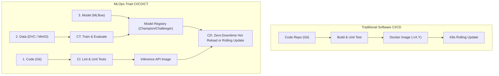
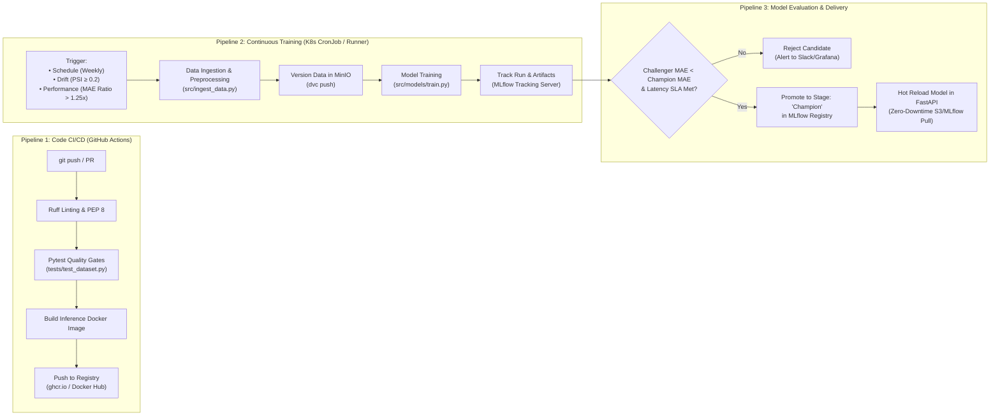

# CI/CD and Continuous Training (CT) Design in MLOps

> **Document:** Engineering Design & Workflow Specification  
> **Status:** Draft / Active Specification  
> **Target Phases:** Phase 14 (Continuous Training) & Phase 15 (CI/CD) — Lab Modules LK-06/LK-07

---

## 1. Traditional DevOps vs. MLOps CI/CD: Fundamental Differences

In traditional software engineering, the single source of truth is **Code**. When code changes, the pipeline compiles/tests it, builds a container image (`:latest` or `:v1.2.3`), pushes it to a container registry (Docker Hub/GHCR), and triggers a Kubernetes rolling update.

In **Predictive Autoscaling MLOps**, software behavior is determined by **three interdependent dimensions**:
1. **Code** (ETL scripts, model architectures, FastAPI serving, scaling controllers)
2. **Data** (continuous time-series metrics from Prometheus, tracked by DVC)
3. **Model Artifacts** (trained weights, hyperparameter configs, scalers, tracked in MLflow)



Consequently, CI/CD in this repository is structured into **three distinct pipelines**:

1. **CI/CD for Code** (triggered by Git commits)
2. **Continuous Training (CT)** (triggered by scheduled intervals, data drift, or model degradation)
3. **Continuous Delivery (CD) for Models** (triggered when a candidate model surpasses the production baseline)

---

## 2. End-to-End MLOps Pipeline Architecture



---

## 3. Pipeline Breakdown in Detail

### 3.1 Pipeline 1: Code CI/CD (Developer Workflow)

This pipeline resembles traditional CI/CD and activates whenever developers modify application logic, configuration, or API handlers.

* **Trigger:** `git push` or `pull_request` against `main` or release branches.
* **Execution Environment:** GitHub Actions runner.
* **Stages:**
  1. **Static Analysis & Linting:** Run `ruff check .` and `ruff format --check .`.
  2. **Data & Code Quality Gates:** Execute unit tests and dataset schema validation via `pytest`:
     - Verification of monotonic timestamps.
     - Verification of no unexpected NaNs in feature matrix.
     - Verification of forecast horizon integrity ($t+60\text{s}$).
  3. **Container Build:** Build container image for the inference server (`api/Dockerfile`).
  4. **Image Push:** Push versioned image tag (e.g., `ghcr.io/oktavsm/predictive-autoscaling-api:sha-<commit_id>`) to the registry.
  5. **Deployment Update:** Update Kubernetes manifests or invoke `kubectl rollout restart deployment/mlops-inference-api -n mlops`.

---

### 3.2 Pipeline 2: Continuous Training (CT Pipeline)

The Continuous Training pipeline is unique to MLOps. It retrains the time-series forecasting model on fresh operational telemetry without requiring manual developer code commits.

#### Trigger Mechanisms
1. **Scheduled Interval:** Runs on a weekly cadence (e.g., Sunday 02:00 UTC) to incorporate recent seasonality and shift patterns.
2. **Data Drift Detection:** Alertmanager or drift detector flags Population Stability Index ($\text{PSI} \ge 0.2$) on incoming request rates.
3. **Model Performance Degradation:** Rolling Mean Absolute Error ($\text{MAE}_{\text{rolling}} > 1.25 \times \text{MAE}_{\text{train}}$) over a moving 1-hour window.

#### Retraining Workflow
1. **Ingest Latest Telemetry:** Executes [`src/ingest_data.py`](../src/ingest_data.py) to extract metric windows from Prometheus.
2. **Feature Pipeline:** Executes [`src/preprocess.py`](../src/preprocess.py) to produce normalized lag, rolling, and delta features.
3. **Data Versioning:** Tracks new datasets with DVC and pushes pointers to S3/MinIO:
   ```bash
   dvc add data/raw/ data/processed/
   dvc push -r minio
   ```
4. **Model Retraining:** Fits candidate models (LightGBM, Random Forest, or Ridge Regression) using hyperparameter configurations from `configs/model_config.yaml`.
5. **Experiment Logging:** Logs all training parameters, evaluation curves, feature importance, and serialized model files to **MLflow Tracking Server**.

---

### 3.3 Pipeline 3: Continuous Delivery (CD) for Models (Promotion & Deployment)

How does a new model get served to Kubernetes without breaking live autoscaling?

#### Champion vs. Challenger Pattern

```
                       ┌─────────────────────────────┐
                       │  MLflow Model Registry      │
                       │                             │
                       │  Current: @champion (v2)    │
                       │  Candidate: @challenger (v3)│
                       └──────────────┬──────────────┘
                                      │
                         Automated Evaluation Gate
                                      │
              ┌───────────────────────┴───────────────────────┐
              ▼                                               ▼
     MAE(v3) < MAE(v2)                               MAE(v3) ≥ MAE(v2)
     & Inference Latency < 20ms                      (No improvement)
              │                                               │
              ▼                                               ▼
   Promote v3 to @champion                             Keep v2 as @champion
   Demote v2 to @archived                              Alert Team of Rejection
              │
              ▼
   Notify FastAPI Serving Layer
```

#### How Model Deployment Actually Happens (Two Architecture Options)

Unlike typical web applications where code and artifact are packaged into one image, MLOps offers two deployment styles:

| Approach | Mechanism | Pros | Cons | Recommendation |
|---|---|---|---|---|
| **Option A: Dynamic Model Hot-Reload** | The FastAPI inference container runs a persistent base image. When a new champion model is promoted in MLflow, FastAPI pulls the new `.joblib`/ONNX artifact directly from MinIO/MLflow via a `/reload-model` webhook. | **Zero pod restarts.** Instant deployment in < 2 seconds. No image builds needed for data-only updates. | API pods require S3/MLflow network access and credentials. | **Recommended for Production MLOps.** |
| **Option B: Model-Bake Container Delivery** | Retraining pipeline builds a brand new Docker image containing the serialized model inside `/models/model.joblib`. K8s executes a rolling update. | Completely immutable container; no external S3 credentials needed by inference pod. | Every retraining cycle takes 3–5 minutes to build and push Docker images. | Useful for air-gapped or strictly audited systems. |

In this project, **Option A** is the primary target because model updates happen frequently as traffic dynamics shift, while the FastAPI inference code remains unchanged.

---

## 4. Concrete CI/CD Implementation Specifications

### 4.1 GitHub Actions Workflow: Code Quality & CI

```yaml
# .github/workflows/ci.yml (Reference Specification)
name: MLOps CI Quality Gate

on:
  push:
    branches: [main, develop]
  pull_request:
    branches: [main]

jobs:
  lint-and-test:
    runs-on: ubuntu-latest
    steps:
      - name: Checkout Code
        uses: actions/checkout@v4

      - name: Set up Python 3.12
        uses: actions/setup-python@v5
        with:
          python-version: "3.12"
          cache: "pip"

      - name: Install Dependencies
        run: |
          pip install --upgrade pip
          pip install -r requirements-dev.txt

      - name: Lint with Ruff
        run: |
          ruff check .
          ruff format --check .

      - name: Run Test Quality Gates
        run: |
          pytest -v tests/
```

### 4.2 Retraining Pipeline Script (Automated Evaluation Gate)

```python
# pipelines/evaluate_and_promote.py (Conceptual Skeleton)
import mlflow
from mlflow.tracking import MlflowClient

def evaluate_and_promote(candidate_run_id: str, model_name: str = "workload-forecaster"):
    client = MlflowClient()
    
    # Get current champion metrics
    champion = client.get_model_version_by_alias(model_name, "champion")
    champion_mae = float(champion.tags.get("val_mae", 999.0))
    
    # Get challenger metrics
    candidate_run = client.get_run(candidate_run_id)
    candidate_mae = candidate_run.data.metrics["val_mae"]
    candidate_latency = candidate_run.data.metrics.get("p95_inference_ms", 5.0)
    
    # Gate condition: strictly better MAE and inference latency < 20ms
    if candidate_mae < champion_mae and candidate_latency < 20.0:
        # Register new model version
        model_uri = f"runs:/{candidate_run_id}/model"
        mv = mlflow.register_model(model_uri, model_name)
        
        # Promote alias
        client.set_registered_model_alias(model_name, "champion", mv.version)
        print(f"[+] Promoted version {mv.version} to @champion (MAE: {candidate_mae:.4f} < {champion_mae:.4f})")
        
        # Trigger hot-reload in live FastAPI pod
        trigger_api_reload()
    else:
        print(f"[-] Candidate rejected (Candidate MAE: {candidate_mae:.4f} >= Champion: {champion_mae:.4f})")
```

---

## 5. Artifact Versioning Matrix

To maintain 100% reproducibility in case of incidents or audit rollbacks, every deployed prediction is traceable back to its originating code, data, and model:

| Artifact | Management Tool | Storage Location | Versioning Identifier |
|---|---|---|---|
| **Pipeline & API Code** | Git | GitHub (`oktavsm/predictive-autoscaling-mlops`) | Git Commit SHA (e.g., `72676a0`) |
| **Telemetry Datasets** | DVC | MinIO (`storage.titipin.me/mlops-dvc`) | DVC Content Hash (`.dvc` pointer files) |
| **Trained Models** | MLflow | MinIO Artifact Store + PostgreSQL/SQLite Backend | MLflow Run ID & Model Registry Version (`v1`, `v2`, alias `@champion`) |
| **Container Images** | Docker Registry | GitHub Container Registry / Docker Hub | Image Digest (`sha256:...`) & Semantic Tags (`v0.1.0`) |
| **K8s Deployments** | GitOps / K3s | `infrastructure/kubernetes/` | Resource Manifest Git SHA |

---

## 6. Implementation Roadmap for CI/CD/CT in Coursework

* **LK-04 (Current):** Standalone reproducible ingestion and preprocessing scripts in `src/`.
* **LK-05:** Introduce DVC pipeline tracking connected to MinIO remote storage (`dvc.yaml`).
* **LK-06:** Introduce MLflow tracking, experiment logging, and model candidate training.
* **LK-07:** Implement Automated Model Promotion (`@champion`), GitHub Actions CI quality gates, and live Kubernetes deployment.
