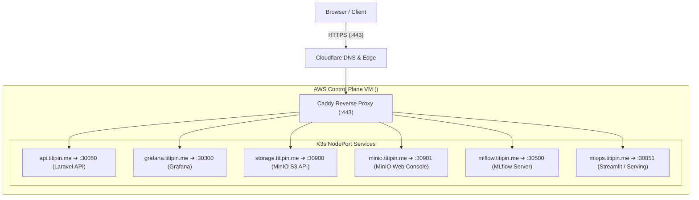

# Cloudflare Domain Architecture & Caddy Reverse Proxy Setup
> **Public Edge Domain:** `titipin.me`  
> **Ingress Architecture:** Cloudflare DNS & TLS Edge ➔ Host Caddy Reverse Proxy ➔ Kubernetes NodePort Services  

---

## 1. Domain Routing & Cluster Architecture

Seluruh antarmuka grafis (*Web UI*) dan endpoint API diarahkan melalui **Caddy Reverse Proxy** yang berjalan di VM Control Plane klaster K3s AWS. Caddy secara otomatis mengelola sertifikat SSL/TLS (HTTPS) dari Let's Encrypt / ZeroSSL dan meneruskan trafik ke *NodePort Service* Kubernetes di jaringan internal.



---

## 2. Daftar DNS Record pada Cloudflare

Buka dashboard [Cloudflare](https://dash.cloudflare.com/) ➔ Pilih domain **`titipin.me`** ➔ Masuk menu **DNS** ➔ **Records** ➔ Konfigurasi baris record berikut:

| Subdomain | Tipe | IPv4 Target | Proxy Status | Layanan & Deskripsi Sistem |
|---|:---:|---|:---:|---|
| **`api`** | `A` | `<CONTROL_PLANE_IP>` | DNS only / Proxied | Backend API Laravel E-Commerce |
| **`grafana`** | `A` | `<CONTROL_PLANE_IP>` | DNS only / Proxied | Observability & Alerting Dashboard |
| **`storage`** | `A` | `<CONTROL_PLANE_IP>` | DNS only / Proxied | MinIO S3 Object Storage API (DVC Remote) |
| **`minio`** | `A` | `<CONTROL_PLANE_IP>` | DNS only / Proxied | MinIO Web Console UI (Bucket Browser) |
| **`mlflow`** | `A` | `<CONTROL_PLANE_IP>` | DNS only / Proxied | MLflow Experiment Tracking & Registry UI |
| **`mlops`** | `A` | `<CONTROL_PLANE_IP>` | DNS only / Proxied | Streamlit MLOps Predictive Control Dashboard |

> [!NOTE]
> Ganti `<CONTROL_PLANE_IP>` dengan alamat IP publik asli VM Control Plane Anda (lihat catatan privat di `.env.secrets` atau panduan VM).
> Jika menggunakan opsi **Proxied** di Cloudflare, pastikan pengaturan SSL/TLS di menu **SSL/TLS ➔ Overview** Cloudflare disetel ke mode **Full** (bukan Flexible).

---

## 3. Konfigurasi Caddyfile Terpadu pada Control Plane

Di VM Control Plane, berkas `/etc/caddy/Caddyfile` dapat diperbarui menjadi konfigurasi terpadu berikut:

```caddy
{
    metrics {
        per_host
    }
}

# 1. Laravel E-Commerce Backend (Workload Target)
api.titipin.me {
    reverse_proxy 127.0.0.1:30080
}

# 2. Prometheus & Grafana Observability Dashboard
grafana.titipin.me {
    reverse_proxy 127.0.0.1:30300
}

# 3. MinIO S3 Object Storage API (DVC Remote)
storage.titipin.me {
    reverse_proxy 127.0.0.1:30900
}

# 4. MinIO Web Console UI (Bucket Browser)
minio.titipin.me {
    reverse_proxy 127.0.0.1:30901
}

# 5. MLflow Tracking & Model Registry UI
mlflow.titipin.me {
    reverse_proxy 127.0.0.1:30500
}

# 6. Streamlit MLOps Dashboard & Serving API
mlops.titipin.me {
    reverse_proxy 127.0.0.1:30851
}

# 7. Edge Telemetry Metrics Exporter untuk Prometheus Scraping
:9180 {
    metrics /metrics
}
```

---

## 4. Langkah Penerapan (*Deployment*) pada Control Plane

Setelah DNS di Cloudflare ditambahkan dan berkas `/etc/caddy/Caddyfile` disimpan:

```bash
# 1. Validasi sintaks Caddyfile
sudo caddy validate --config /etc/caddy/Caddyfile

# 2. Terapkan konfigurasi baru tanpa downtime
sudo systemctl reload caddy
# atau: sudo systemctl restart caddy

# 3. Verifikasi status operasional Caddy
sudo systemctl status caddy
```

Dengan langkah di atas, seluruh dashboard dan endpoint inferensi dapat diakses secara publik dan aman via HTTPS untuk pemantauan operasional dan evaluasi performa sistem end-to-end.
