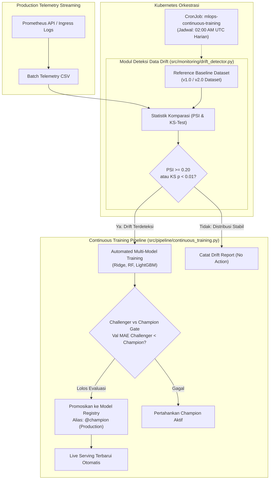

# Otomatisasi Continuous Training (CT) Pipeline & Deteksi Data Drift (LK-12)
## Repositori: `oktavsm/predictive-autoscaling-mlops`
### Modul: Adaptabilitas Model, Deteksi Pergeseran Distribusi, & Siklus Retraining

---

## 1. Konsep & Arsitektur Deteksi Data Drift

Seiring berjalannya waktu dan dinamika perilaku pengguna (*e-commerce shopping events*, *flash sales*, atau degradasi performa database), distribusi telemetri operasional dapat mengalami pergeseran statistik (*data drift* atau *concept drift*). Pergeseran ini menyebabkan akurasi prediksi beban model Champion menurun jika model tidak dilatih ulang (*model staleness*).



---

## 2. Metrik Statistik Deteksi Drift

Modul `src/monitoring/drift_detector.py` memadukan dua metode uji statistik komplementer:

### 2.1. Population Stability Index (PSI)
Mengukur deviasi distribusi probabilitas suatu variabel numerik antara dataset referensi ($P_{\text{ref}}$) dan dataset produksi terkini ($P_{\text{curr}}$) yang dibagi ke dalam 10 kuantil (*deciles*):

$$\text{PSI} = \sum_{i=1}^{10} \Big( P_{\text{curr}, i} - P_{\text{ref}, i} \Big) \times \ln\left(\frac{P_{\text{curr}, i}}{P_{\text{ref}, i}}\right)$$

**Standar Ambang Batas Industri MLOps:**
- $\text{PSI} < 0.10$: **STABLE (NO DRIFT)** — Tidak ada perubahan signifikan. Model tetap dapat dipercaya.
- $0.10 \le \text{PSI} < 0.20$: **MODERATE DRIFT (WARNING)** — Terdapat sedikit pergeseran beban. Sistem memunculkan notifikasi peringatan.
- $\text{PSI} \ge 0.20$: **SIGNIFICANT DRIFT (CRITICAL)** — Pergeseran distribusi signifikan. Kontroler otomatis memicu pipeline *Continuous Training*.

### 2.2. Uji Dua Sampel Kolmogorov-Smirnov (KS-Test)
Uji non-parametrik yang membandingkan fungsi distribusi kumulatif empiris (*Empirical Cumulative Distribution Functions* / ECDF). Jika nilai signifikansi $p\text{-value} < 0.01$, hipotesis nol ditolak, menandakan kedua sampel berasal dari populasi dengan distribusi yang secara statistik berbeda.

---

## 3. Fitur Telemetri yang Diaudit

Lima fitur utama penentu kapasitas pod yang diawasi secara berkelanjutan:
1. `request_rate`: Beban trafik masuk rata-rata (RPS).
2. `php_cpu_cores`: Konsumsi CPU runtime PHP-FPM.
3. `p95_latency_seconds`: Latensi respons pada persentil 95.
4. `php_memory_mb`: Penggunaan memori agregat kontainer (MB).
5. `rps_roll_mean_60s`: Laju rata-rata bergerak beban kerja 60 detik.

---

## 4. Orkestrasi Retraining & Model Promotion

Ketika drift terkonfirmasi:
1. **Pre-processing Otomatis:** Dataset batch baru dibersihkan dari *null* dan direkayasa fitur *rolling lag*.
2. **Pelatihan Multi-Model:** Pelatihan paralel model Ridge, Random Forest, dan LightGBM dengan pencatatan parameter ke MLflow.
3. **Challenger vs Champion Gate:** Model penantang (*challenger*) diuji pada subset data validasi. Jika MAE penantang lebih rendah dari model Champion yang sedang melayani trafik, model penantang secara otomatis:
   - Didaftarkan sebagai versi baru di **MLflow Model Registry**.
   - Dipromosikan ke tahap `Production` dengan alias `@champion`.
   - Manifest `models/model_registry_manifest.yaml` diperbarui secara deterministik.
4. **Audit Logging:** Riwayat eksekusi disimpan ke `reports/continuous_training_log.json` dan `reports/drift_report_latest.json`.

---

## 5. Panduan Verifikasi Operasional (Runbook)

### 5.1. Menjalankan Audit Deteksi Data Drift
```bash
make drift-check
# atau: python src/monitoring/drift_detector.py
```
*Output menampilkan tabel skor PSI, nilai p-value KS, dan status klasifikasi per fitur.*

### 5.2. Menjalankan Pipeline Continuous Training Penuh
```bash
make continuous-training
# atau jalankan paksa: python src/pipeline/continuous_training.py --force
```

### 5.3. Memeriksa Status CronJob Terjadwal di Klaster K8s
```bash
make cronjob-status
# atau: kubectl get cronjobs,jobs -n mlops
```

---

## 6. Hasil Pengujian Unit Otomatis

Seluruh logika deteksi drift telah tervalidasi menggunakan `pytest`:
- **Total Test Cases:** 25 pengujian (`test_dataset.py`, `test_inference_api.py`, `test_model_registry.py`, `test_predictive_scaler.py`, `test_drift_detector.py`).
- **Status:** 100% Passed.
- **Ruff Code Hygiene:** 0 Lint error.
