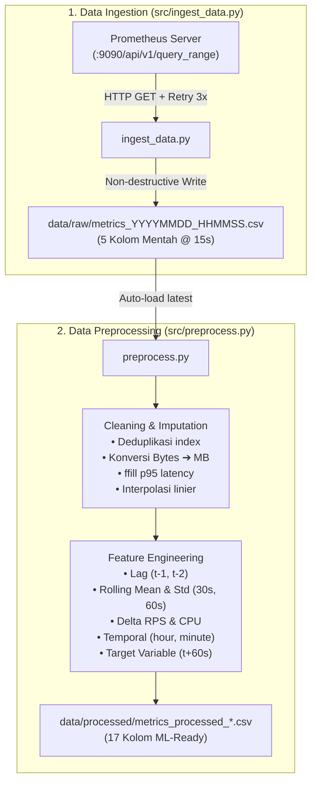

# Dokumentasi Teknis: Modul Ingestion & Preprocessing (LK-04)

> **Modul:** `src/ingest_data.py` & `src/preprocess.py`  
> **Status:** Production-Ready & Lolos Uji Quality Gate  
> **Konteks:** Lembar Kerja 04 (LK-04) — Data Ingestion & Preprocessing Pipeline

---

## 1. Ikhtisar Arsitektur Pipeline

Pipeline data pada LK-04 bertugas mengubah telemetri mentah dari Prometheus menjadi dataset *time-series supervised learning* yang siap digunakan untuk melatih model peramalan beban kerja (*workload forecasting*) pada LK-06.



---

## 2. Bedah Modul: `src/ingest_data.py`

Modul ini bertanggung jawab menarik metrik operasional secara otomatis dari Prometheus HTTP API menggunakan library `requests`.

### 2.1 Konfigurasi & Parameter Global

| Parameter | Nilai Default | Penjelasan |
|---|---|---|
| `PROM_URL` | `http://127.0.0.1:9090` | Endpoint Prometheus (dapat di-override via env var `PROM_URL`). |
| `DEFAULT_STEP` | `15` detik | Resolusi sampel data, diselaraskan dengan siklus evaluasi Kubernetes HPA (15s). |
| `MAX_RETRIES` | `3` | Batas toleransi percobaan ulang saat query gagal akibat gangguan jaringan. |
| `RETRY_BACKOFF` | `2.0` detik | Faktor pengali jeda eksponensial ($2^1, 2^2, 2^3$ detik). |
| `REQUEST_TIMEOUT`| `30` detik | Batas waktu tunggu respons HTTP sebelum dianggap timeout. |
| `OUTPUT_DIR` | `data/raw/` | Direktori tujuan penyimpanan berkas mentah. |

---

### 2.2 PromQL Queries (`QUERIES`)

Modul ini mendefinisikan 5 kueri PromQL yang dieksekusi secara independen:

1. **`request_rate`** (Trafik Masuk — req/s):
   ```promql
   sum(rate(caddy_http_requests_total{host=~"api.titipin.me.*"}[1m]))
   ```
   *Fungsi:* Menghitung laju permintaan HTTP per detik pada reverse proxy Caddy dalam jendela 1 menit.
2. **`php_cpu_cores`** (Konsumsi CPU — cores):
   ```promql
   sum(rate(container_cpu_usage_seconds_total{namespace="titipin",pod=~"laravel-backend-.*",container="php"}[1m]))
   ```
   *Fungsi:* Mengukur total penggunaan core CPU oleh container runtime PHP-FPM.
3. **`php_memory_bytes`** (Konsumsi Memori — bytes):
   ```promql
   sum(container_memory_working_set_bytes{namespace="titipin",pod=~"laravel-backend-.*",container="php"})
   ```
   *Fungsi:* Mengukur alokasi memori aktif (*working set*) container PHP.
4. **`replicas`** (Jumlah Pod Aktif — integer):
   ```promql
   kube_deployment_status_replicas{namespace="titipin",deployment="laravel-backend"}
   ```
   *Fungsi:* Merekam jumlah replika pod yang sedang berjalan dari status deployment Kubernetes.
5. **`p95_latency_seconds`** (Latensi P95 — detik):
   ```promql
   histogram_quantile(0.95, sum by (le) (rate(caddy_http_request_duration_seconds_bucket{host=~"api.titipin.me.*"}[1m])))
   ```
   *Fungsi:* Menghitung persentil ke-95 dari durasi respons HTTP untuk memantau degradasi SLO.

---

### 2.3 Rincian Fungsi `src/ingest_data.py`

#### A. `check_prometheus_health() -> bool`
* **Tujuan:** Melakukan *pre-flight check* ke endpoint `GET /-/healthy` milik Prometheus.
* **Logika:** Mengembalikan `True` jika status code HTTP adalah `200`. Jika gagal atau timeout (5 detik), proses ingestion dihentikan lebih awal dengan pesan peringatan yang ramah pengguna.

#### B. `query_range(metric_name, promql, start, end, step) -> pd.Series`
* **Tujuan:** Menarik satu deret waktu metrik dari Prometheus API endpoint `/api/v1/query_range`.
* **Mekanisme Ketahanan (Fault Tolerance):**
  * Membungkus pemanggilan `requests.get` dalam loop percobaan hingga `MAX_RETRIES` (3 kali).
  * Menangani exception spesifik: `ConnectionError`, `Timeout`, dan `HTTPError`.
  * Menerapkan jeda bertingkat (*exponential backoff*): `wait = RETRY_BACKOFF ** attempt` (misal 2 detik, lalu 4 detik).
* **Transformasi Data:**
  * Membaca array pasangan `[timestamp, value]` dari JSON Prometheus.
  * Mengonversi epoch timestamp detik menjadi `pd.to_datetime` dengan zona waktu UTC eksplisit.
  * Mengembalikan objek `pd.Series` float dengan index berupa datetime UTC.

#### C. `ingest(start, end, step, output_path) -> int`
* **Tujuan:** Mengorkestrasi penarikan seluruh metrik, penggabungan tabel, dan penulisan berkas.
* **Alur Eksekusi:**
  1. Memvalidasi ketersediaan Prometheus via `check_prometheus_health()`.
  2. Melakukan iterasi ke seluruh kueri dalam dictionary `QUERIES` dan menampung hasilnya ke dictionary DataFrame.
  3. Menggabungkan deret waktu ke dalam satu `pd.DataFrame` berindeks `timestamp` yang diurutkan secara kronologis (`sort_index()`).
  4. Membuat direktori tujuan secara otomatis (`os.makedirs(..., exist_ok=True)`).
  5. Menulis data ke file CSV di `output_path`.
  6. Mencetak ringkasan statistik deskriptif (`count`, `mean`, `min`, `max`) ke log terminal.
  7. Mengembalikan total baris yang tersimpan (atau `0` jika gagal).

#### D. `parse_args()` & `main() -> int`
* **Tujuan:** Menangani antarmuka baris perintah (CLI).
* **Fitur Non-Destruktif:**
  * Jika argumen `--output` tidak diisi, skrip otomatis menghasilkan nama file dengan format waktu:
    `data/raw/metrics_YYYYMMDD_HHMMSS.csv`
  * Pendekatan ini menjamin bahwa setiap kali skrip dijalankan ulang (simulasi periodik), file lama tidak akan pernah tertimpa (*non-destructive storage*).
* **Fleksibilitas Window Waktu:**
  * Opsi `--minutes N`: Mengambil data $N$ menit terakhir dari waktu sekarang (UTC).
  * Opsi `--start` & `--end`: Menerima rentang waktu absolut ISO 8601 (misal: `2026-09-28T10:00:00Z`).

---

## 3. Bedah Modul: `src/preprocess.py`

Modul ini bertugas membersihkan anomali data mentah dan membentuk fitur-fitur baru (*feature engineering*) agar siap digunakan dalam pelatihan model regresi (*ML-ready*).

### 3.1 Parameter & Horizon Prediksi

```python
PREDICTION_HORIZON_STEPS = 4  # 4 langkah x 15 detik = 60 detik ke depan
ROLL_WINDOW_30S = 2           # 2 langkah x 15 detik = 30 detik
ROLL_WINDOW_60S = 4           # 4 langkah x 15 detik = 60 detik
```
* **Justifikasi Empiris Horizon 60 Detik:**  
  Hasil pengukuran langsung pada cluster K3s menunjukkan bahwa proses *scale-out* pod Laravel (mulai dari evaluasi HPA, pull image, inisialisasi sidecar Nginx & PHP-FPM, hingga readiness probe `Ready`) membutuhkan waktu rata-rata **45 detik**. Oleh karena itu, horizon peramalan ditetapkan sebesar **60 detik** (4 langkah $\times$ 15 detik) agar pod baru siap menerima trafik *sebelum* degradasi latensi terjadi.

---

### 3.2 Rincian Fungsi `src/preprocess.py`

#### A. `find_latest_raw_file(raw_dir: Path) -> Path | None`
* **Tujuan:** Melakukan pencarian otomatis berkas CSV mentah terbaru di direktori `data/raw/`.
* **Logika:** Mengabaikan berkas khusus (seperti `master_*`), lalu memilih berkas dengan atribut waktu modifikasi (`st_mtime`) paling akhir. Memungkinkan pemanggilan `python src/preprocess.py` tanpa harus mengetik nama file panjang.

#### B. `load_raw(input_path: Path) -> pd.DataFrame`
* **Tujuan:** Membaca berkas CSV mentah ke dalam memori.
* **Penanganan Waktu:** Mengurai kolom `timestamp` sebagai indeks dan memastikan bahwa indeks waktu berzona UTC (`tz_localize` atau `tz_convert`).

#### C. `validate_columns(df: pd.DataFrame) -> pd.DataFrame`
* **Tujuan:** Memastikan keberadaan 5 kolom utama (`request_rate`, `php_cpu_cores`, `php_memory_bytes`, `replicas`, `p95_latency_seconds`). Jika ada kolom yang absen dari kueri Prometheus, kolom tersebut diinisialisasi dengan nilai `NaN` agar pipeline tidak *crash*.

#### D. `clean(df: pd.DataFrame) -> pd.DataFrame`
* **Tujuan:** Membersihkan data dari anomali rekaman telemetri.
* **Tahapan:**
  1. **Pengurutan Monotonik:** Menjalankan `df.sort_index()` untuk memastikan data berurutan dari masa lampau ke masa kini.
  2. **Deduplikasi:** Menggunakan `df[~df.index.duplicated(keep="last")]`. Jika Prometheus mencatat timestamp ganda, hanya data observasi terakhir yang dipertahankan.
  3. **Konversi Satuan:**
     $$\text{php\_memory\_mb} = \frac{\text{php\_memory\_bytes}}{1{,}048{,}576}$$
     Kolom `php_memory_bytes` dibuang dan digantikan oleh `php_memory_mb` (dibulatkan 2 desimal) agar skala nilai lebih seimbang bagi algoritma ML.
  4. **Imputasi Missing Values:**
     * **`p95_latency_seconds` (Forward-Fill):** Pada periode tidak ada trafik sama sekali, Caddy tidak menghasilkan histogram latensi sehingga nilai menjadi `NaN`. Digunakan metode `ffill()` dengan asumsi latensi sistem diasumsikan sama dengan kondisi terakhir yang tercatat.
     * **Metrik Operasional Lain (Interpolasi Linier):** Jika terdapat *gap* singkat ($\le 5$ langkah berturut-turut) akibat *scraping drop*, nilai diisi menggunakan interpolasi linier (`interpolate(method='linear', limit=5)`).

#### E. `engineer_features(df: pd.DataFrame) -> pd.DataFrame`
* **Tujuan:** Menghasilkan representasi matematis dari dinamika beban kerja.
* **Fitur yang Dibentuk:**
  1. **Lag Features:**
     * `rps_lag1 = request_rate(t-15s)`
     * `rps_lag2 = request_rate(t-30s)`
     * `cpu_lag1 = php_cpu_cores(t-15s)`
     * `cpu_lag2 = php_cpu_cores(t-30s)`
     * *Manfaat:* Memberikan konteks historis jangka pendek kepada model.
  2. **Rolling Statistics (Statistik Bergerak):**
     * `rps_roll_mean_30s`: Rata-rata bergerak request rate dalam 30 detik terakhir (window 2 langkah).
     * `rps_roll_mean_60s`: Rata-rata bergerak request rate dalam 60 detik terakhir (window 4 langkah).
     * `rps_roll_std_60s`: Standar deviasi bergerak request rate dalam 60 detik terakhir.
     * *Manfaat:* Menangkap tren rata-rata dan tingkat volatilitas/fluktuasi trafik.
  3. **Delta Features (Laju Perubahan):**
     * `rps_delta = request_rate(t) - request_rate(t-15s)`
     * `cpu_delta = php_cpu_cores(t) - php_cpu_cores(t-15s)`
     * *Manfaat:* Mengidentifikasi apakah trafik sedang mengalami lonjakan mendadak (*spike onset*) atau penurunan tajam (*drop*).
  4. **Fitur Temporal:**
     * `hour` (0–23) dan `minute` (0–59) dari indeks timestamp UTC untuk menangkap pola musiman harian.
  5. **Target Variable ($y$):**
     ```python
     df["target_rps_60s"] = df["request_rate"].shift(-4)
     ```
     * *Manfaat:* Menggeser nilai `request_rate` mundur sebanyak 4 langkah (60 detik ke depan) sebagai label target prediksi *supervised learning*.

#### F. `drop_incomplete_rows(df: pd.DataFrame) -> pd.DataFrame`
* **Tujuan:** Menghapus baris yang tidak lengkap akibat pergeseran waktu (*shift*).
* **Mekanisme:** 4 baris paling akhir dari dataset secara alami tidak memiliki nilai target (karena observasi 60 detik ke depan belum terjadi). Baris-baris ini dibuang menggunakan `df.dropna(subset=["target_rps_60s"])` agar tidak merusak proses pelatihan model.

#### G. `save_processed(df, output_path)` & `main()`
* **Tujuan:** Menyimpan DataFrame hasil pemrosesan ke folder `data/processed/metrics_processed_YYYYMMDD_HHMMSS.csv` dan mencetak ringkasan dimensi baris dan kolom.

---

## 4. Kamus Fitur Dataset Akhir (17 Kolom)

Setelah melalui tahap preprocessing, dataset memiliki 17 kolom numerik:

| No | Nama Kolom | Tipe Data | Satuan | Kategori | Penjelasan & Peran dalam ML |
|:--:|---|:---:|:---:|:---:|---|
| 1 | `request_rate` | Float | req/s | Raw Metric | Nilai trafik HTTP saat ini ($t$). |
| 2 | `php_cpu_cores` | Float | cores | Raw Metric | Total utilisasi CPU PHP-FPM saat ini ($t$). |
| 3 | `replicas` | Float | pod | Raw Metric | Jumlah pod Laravel aktif saat ini ($t$). |
| 4 | `p95_latency_seconds` | Float | detik | Raw Metric | Persentil ke-95 durasi respons HTTP saat ini ($t$). |
| 5 | `php_memory_mb` | Float | MB | Converted | Total alokasi memori PHP-FPM dalam Megabytes. |
| 6 | `rps_lag1` | Float | req/s | Lag Feature | Trafik 1 langkah ke belakang ($t - 15\text{s}$). |
| 7 | `rps_lag2` | Float | req/s | Lag Feature | Trafik 2 langkah ke belakang ($t - 30\text{s}$). |
| 8 | `cpu_lag1` | Float | cores | Lag Feature | Utilisasi CPU 1 langkah ke belakang ($t - 15\text{s}$). |
| 9 | `cpu_lag2` | Float | cores | Lag Feature | Utilisasi CPU 2 langkah ke belakang ($t - 30\text{s}$). |
| 10 | `rps_roll_mean_30s` | Float | req/s | Rolling Stat | Nilai rata-rata trafik dalam window 30 detik. |
| 11 | `rps_roll_mean_60s` | Float | req/s | Rolling Stat | Nilai rata-rata trafik dalam window 60 detik. |
| 12 | `rps_roll_std_60s` | Float | req/s | Rolling Stat | Tingkat variabilitas/volatilitas trafik dalam 60 detik. |
| 13 | `rps_delta` | Float | req/s | Delta Feature | Kecepatan perubahan trafik antar langkah berturutan. |
| 14 | `cpu_delta` | Float | cores | Delta Feature | Kecepatan perubahan CPU antar langkah berturutan. |
| 15 | `hour` | Integer | jam (0–23) | Temporal | Jam observasi UTC untuk menangkap musiman diurnal. |
| 16 | `minute` | Integer | menit (0–59) | Temporal | Menit observasi untuk resolusi intra-jam. |
| 17 | **`target_rps_60s`** | Float | req/s | **Target ($y$)** | **Variabel Target:** Prediksi trafik 60 detik ke depan ($t + 60\text{s}$). |

---

## 5. Ringkasan Eksekusi & Instruksi Operasional

### Menjalankan via Makefile (Direkomendasikan)

```bash
# 1. Buka tunnel Prometheus ke background
make port-forward

# 2. Eksekusi penarikan data 15 menit terakhir
make ingest

# 3. Eksekusi preprocessing pada data mentah terbaru
make preprocess

# 4. Tampilkan pratinjau dataset hasil feature engineering
make preview

# 5. Jalankan automated quality gates
make test
```

### Menjalankan via Script Python Langsung

```bash
# Ingestion dengan rentang waktu kustom (misal 30 menit)
.venv/bin/python src/ingest_data.py --minutes 30

# Ingestion dengan rentang waktu absolut ISO 8601
.venv/bin/python src/ingest_data.py --start 2026-09-28T10:00:00Z --end 2026-09-28T10:30:00Z

# Preprocessing file tertentu
.venv/bin/python src/preprocess.py --input data/raw/metrics_20260928_102236.csv --output data/processed/my_dataset.csv
```
