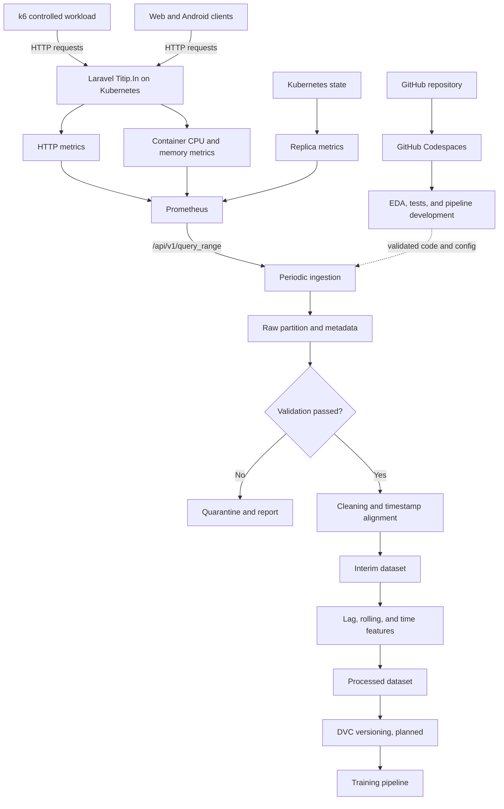

# Perancangan Arsitektur Pipeline Data Dinamis

## Predictive Autoscaling MLOps pada Backend Laravel Titip.In di Kubernetes

| Identitas dokumen | Isi |
|---|---|
| Mata kuliah | `<nama mata kuliah>` |
| Kelompok | `<nama atau nomor kelompok>` |
| Anggota | `<nama anggota>` |
| Repositori | `oktavsm/predictive-autoscaling-mlops` |
| Cabang eksperimen | `feat/initial-eda` |
| Status | Rancangan teknis, siap dilengkapi dengan bukti pelaksanaan |

> Catatan status: dokumen ini membedakan komponen yang sudah tersedia di repositori dari komponen yang masih direncanakan. Angka hasil pengukuran, ambang validasi, target prediksi, interval sampling final, dan performa model tidak dinyatakan sebagai hasil sebelum dibuktikan melalui pengambilan data dan EDA.

## Ringkasan Eksekutif

Proyek ini merancang pipeline data untuk predictive autoscaling pada backend Laravel Titip.In yang berjalan di Kubernetes. Sumber data dinamis utama adalah Prometheus HTTP API. Prometheus mengumpulkan metrik operasional dari aplikasi dan cluster, lalu pipeline ingestion mengambil rentang waktu tertentu melalui endpoint `/api/v1/query_range`.

Grafana k6 berperan sebagai controlled workload generator. k6 mengirim request HTTP nyata ke backend agar eksperimen dapat diulang dengan pola beban yang terkontrol. k6 bukan pembuat dataset. Dataset dibentuk dari metrik yang benar-benar diamati pada Laravel, container, Kubernetes, dan jalur HTTP, kemudian disimpan oleh Prometheus.

Alur yang dirancang adalah:

```text
Prometheus query_range
        ↓
Raw partition + run metadata
        ↓
Schema and quality validation
        ├── gagal → Quarantine + validation report
        └── lulus → Cleaning and timestamp alignment
                         ↓
                      Interim
                         ↓
                Feature engineering
                         ↓
                     Processed
                         ↓
              DVC versioning (planned)
                         ↓
                       Training
```

Pipeline menyimpan partisi data dan metadata setiap run agar asal data, konfigurasi eksperimen, versi kode, serta hasil validasi dapat ditelusuri. Rancangan ini mendukung continual learning readiness, tetapi tidak menyatakan bahwa continual learning otomatis sudah berjalan. Retraining hanya dapat diaktifkan setelah ingestion, validasi, versioning, evaluasi model, dan aturan promosi model teruji.

## 1. Tujuan dan Ruang Lingkup

Dokumen ini bertujuan untuk:

1. menjelaskan sumber data operasional yang bergerak secara kontinu;
2. merancang alur Extract, Transform, Load dari Prometheus sampai dataset siap latih;
3. menetapkan skema awal dan aturan kualitas data;
4. merancang metadata run dan metadata versi dataset;
5. menghubungkan pipeline dengan struktur repositori serta GitHub Codespaces;
6. memisahkan lingkungan pengembangan dari runtime eksperimen di VPS/K3s;
7. menyiapkan bukti yang diperlukan untuk laporan dan presentasi tugas.

Ruang lingkup dokumen berhenti pada dataset siap latih dan rencana pemicu training. Pemilihan target final, horizon prediksi, model, serta ambang retraining tetap menjadi keputusan setelah EDA dan eksperimen sistem.

## 2. Fakta Saat Ini dan Rencana

Tabel berikut mencegah rancangan masa depan terbaca sebagai implementasi yang telah selesai.

| Area | Status saat ini | Tindak lanjut |
|---|---|---|
| GitHub Codespaces | `.devcontainer/devcontainer.json` tersedia dengan Python 3.12, Jupyter, Ruff, Pylance, dan YAML | Pertahankan sebagai lingkungan pengembangan yang reproducible |
| Sumber data | Prometheus dan endpoint `query_range` telah digunakan oleh `scripts/export_dataset.py` | Tambahkan retry terukur, metadata, watermark, dan laporan validasi |
| Metrik ekspor | Request rate, CPU PHP, memory PHP, replica count, dan p95 latency tersedia pada exporter saat ini | Tambahkan query HTTP error rate sebelum menetapkannya sebagai kolom wajib produksi |
| Dataset contoh | `src/data/demo_metrics.csv` tersedia untuk EDA reproducible | Jangan menggantinya tanpa validasi dan pencatatan provenance |
| Pengujian data | Smoke test untuk skema, timestamp, request rate, replica count, dan duplikasi tersedia | Perluas sesuai skema dan aturan kualitas final |
| Workload | Skenario k6 dan runner tersedia | Catat `run_id`, skenario, waktu, konfigurasi, serta versi workload pada setiap eksperimen |
| Struktur ETL | Ekspor dan merge awal tersedia | Implementasikan pass/quarantine, cleaning, interim, processed, dan metadata |
| Feature engineering | Masih tahap rancangan | Validasi lag, rolling window, dan fitur waktu melalui EDA |
| DVC | Direncanakan | Aktifkan setelah lokasi data dan remote storage disepakati |
| Scheduler | Proses manual tersedia | Naikkan bertahap ke cron, lalu Kubernetes CronJob jika kebutuhan operasional sudah jelas |
| Training berulang | Direncanakan | Jalankan hanya setelah data dan evaluasi kandidat model dapat dipercaya |

## 3. Sumber Data Dinamis

### 3.1 Sistem yang diamati

Backend Laravel Titip.In berjalan sebagai workload di Kubernetes. Request dapat berasal dari aplikasi web, aplikasi Android, atau k6 saat eksperimen terkontrol. Sistem observability mencatat perubahan kondisi aplikasi dan cluster sepanjang waktu.

Sumber data primer untuk pipeline ML adalah:

```text
Prometheus HTTP API
└── GET /api/v1/query_range
```

Produsen metrik di bawahnya mencakup:

- reverse proxy atau instrumentation HTTP untuk request rate, latency, dan error;
- cAdvisor atau kubelet untuk penggunaan CPU dan memory container;
- kube-state-metrics untuk jumlah replica deployment;
- Laravel backend sebagai workload utama yang diamati.

### 3.2 Peran k6

k6 mengontrol pola request, concurrency, durasi, dan endpoint mix. k6 tidak menulis nilai request rate, CPU, memory, latency, atau replica count ke dataset ML.

```text
k6
 │  request HTTP nyata
 ▼
Laravel Titip.In pada Kubernetes
 │  menghasilkan perilaku operasional
 ▼
Exporter dan scrape target
 │
 ▼
Prometheus
 │  query_range
 ▼
Pipeline dataset
```

Pemisahan ini penting secara metodologis. Skenario k6 adalah input eksperimen. Metrik Prometheus adalah observasi atas respons sistem terhadap input tersebut.

### 3.3 Mengapa data disebut dinamis

Data bersifat dinamis karena observasi baru muncul seiring waktu dan kondisi sistem berubah.

```text
t0: workload dan keadaan cluster menghasilkan observasi pertama
t1: Prometheus menyimpan observasi berikutnya
t2: jumlah request, resource, latency, atau replica dapat berubah
...
tn: pipeline mengambil jendela data terbaru secara berkala
```

Dataset bukan unduhan satu kali. Pipeline dapat mengambil jendela waktu baru, memvalidasinya, lalu menambahkannya sebagai partisi tanpa menulis ulang raw data lama.

## 4. Metrik Utama dan Skema Data Awal

Skema ini merupakan kontrak awal. Nama kolom dapat dipertahankan agar konsisten dengan exporter yang sudah ada. `http_error_rate` adalah kolom yang direncanakan dan perlu ditambahkan ke query exporter.

| Kolom | Tipe logis | Satuan | Sumber | Aturan awal |
|---|---|---:|---|---|
| `timestamp` | datetime UTC | ISO 8601 | Timestamp hasil Prometheus | Wajib, valid, unik per partisi setelah alignment, urut menaik |
| `request_rate` | float | request/detik | Rate counter HTTP | Tidak boleh negatif |
| `php_cpu_cores` | float | CPU core | cAdvisor/kubelet | Tidak boleh negatif |
| `php_memory_bytes` | float | byte | cAdvisor/kubelet | Tidak boleh negatif |
| `p95_latency_seconds` | float | detik | Histogram latency HTTP | Tidak boleh negatif, `NaN` dapat terjadi jika sampel histogram tidak cukup |
| `replicas` | integer | pod | kube-state-metrics | Tidak boleh negatif, batas operasional mengikuti konfigurasi deployment/scaler |
| `http_error_rate` | float | rasio 0 sampai 1 | Counter respons HTTP | Direncanakan, harus berada pada rentang 0 sampai 1 |
| `run_id` | string | tidak ada | Metadata eksperimen | Wajib untuk eksperimen terkontrol |
| `scenario` | category/string | tidak ada | Metadata k6 atau ingestion | Contoh kategori harus berasal dari skenario yang benar-benar dijalankan |

Jika Prometheus mengembalikan lebih dari satu time series untuk suatu query, pipeline harus mengagregasikan seri secara eksplisit di PromQL atau menolak hasil ambigu. Mengambil elemen pertama tanpa memeriksa label tidak cukup aman untuk pipeline terjadwal.

## 5. Arsitektur Pipeline

### 5.1 Diagram ASCII

```text
                           VPS / K3s RUNTIME

 External clients or k6
          │
          │ HTTP requests
          ▼
   Caddy / Laravel Service
          │
          ▼
 Laravel backend replicas ◄──────────── Kubernetes scaling state
          │                                      │
          ├──────── HTTP metrics                 │ replica metrics
          └──────── container metrics            │
                         │                       │
                         └──────────┬────────────┘
                                    ▼
                              Prometheus
                                    │
                       GET /api/v1/query_range
                                    │
                   ┌────────────────┴────────────────┐
                   │ scheduled ingestion job         │
                   │ query config + watermark        │
                   └────────────────┬────────────────┘
                                    ▼
                         Raw immutable partition
                         + run/dataset metadata
                                    │
                              Validation
                           ┌────────┴────────┐
                           │                 │
                         fail               pass
                           │                 │
                           ▼                 ▼
                      Quarantine          Cleaning
                 + validation report         │
                                             ▼
                                  Resample and align UTC
                                             │
                                             ▼
                                           Interim
                                             │
                                  Feature engineering
                                  lag + rolling + time
                                             │
                                             ▼
                                          Processed
                                             │
                                      DVC (planned)
                                             │
                                             ▼
                                           Training

                         DEVELOPMENT / REPRODUCIBILITY

 GitHub repository ──► Codespaces ──► tests, EDA, pipeline development
                                          │
                                          └── sample/versioned data only
```

### 5.2 Diagram Mermaid



### 5.3 Aliran data per tahap

| Tahap | Input | Proses | Output |
|---|---|---|---|
| Extract | Query PromQL, rentang waktu, step | Panggil `query_range` dengan timeout dan pemeriksaan respons | Respons time series per metrik |
| Raw load | Respons yang berhasil diambil | Gabungkan berdasarkan timestamp tanpa memperbaiki nilai | Partisi raw immutable dan metadata run |
| Validation | Partisi raw | Periksa skema, tipe, waktu, rentang, missing, dan duplikasi | Status pass atau quarantine beserta laporan |
| Cleaning | Data yang lulus validasi | Normalisasi UTC, urutkan, deduplikasi, tangani missing sesuai aturan | Data bersih per metrik |
| Alignment | Metrik dengan timestamp berbeda | Resample pada grid waktu yang sama dan gunakan agregasi sesuai semantik | Tabel time series sejajar |
| Interim load | Tabel yang telah sejajar | Simpan sebelum feature engineering | Dataset interim yang dapat diaudit |
| Feature engineering | Dataset interim | Bentuk lag, rolling statistics, dan fitur waktu yang disetujui EDA | Dataset processed |
| Versioning | Dataset processed dan metadata | Catat dengan DVC serta commit Git terkait | Referensi versi data yang reproducible |
| Training | Versi data, config, dan kode tertentu | Split berdasarkan waktu, train, evaluasi | Kandidat model dan hasil evaluasi |

## 6. Desain Extract dan Ingestion

### 6.1 Konfigurasi ingestion

Parameter ingestion tidak boleh tersebar sebagai angka hard-coded di banyak skrip. Satu konfigurasi perlu mencatat:

- URL Prometheus melalui environment variable atau secret;
- query PromQL per metrik;
- `start`, `end`, dan `step`;
- timeout;
- jumlah retry yang terbatas;
- output path;
- schema version;
- `run_id` dan scenario jika tersedia.

Nilai default exporter saat ini adalah jendela 30 menit dan step 15 detik. Nilai tersebut berguna sebagai baseline implementasi, tetapi belum menjadi interval final penelitian.

### 6.2 Jendela waktu dan watermark

Ingestion terjadwal harus menyimpan watermark berupa timestamp terakhir yang sudah diproses. Run berikutnya mengambil data setelah watermark hingga waktu aman terbaru.

Overlap kecil antarjendela dapat digunakan untuk mengantisipasi data yang terlambat masuk. Duplikasi akibat overlap dihapus secara deterministik berdasarkan timestamp dan identitas seri. Raw response tetap disimpan per run agar proses dapat diaudit.

```text
Run 1: [t0 ---------------- t100]
Run 2:                 [t95 ---------------- t200]
                             └── overlap

Interim setelah deduplikasi: [t0 ------------------------- t200]
```

### 6.3 Pseudocode ingestion

```python
load ingestion_config
load previous_watermark, or use explicit start time for the first run

run_id = create_unique_run_id()
window_start = previous_watermark - configured_overlap
window_end = current_utc_time - configured_safety_delay

for metric_name, promql in configured_queries:
    response = prometheus_query_range(
        query=promql,
        start=window_start,
        end=window_end,
        step=configured_step,
        timeout=configured_timeout,
    )
    verify HTTP status and Prometheus response status
    preserve returned timestamps, values, and relevant labels

write raw partition atomically
write run metadata and checksums

validation_report = validate(raw partition, schema version)
if validation_report has blocking failures:
    move partition reference to quarantine
    record failure without advancing watermark
    stop this run

clean, resample, and align the passed partition
write interim partition atomically
advance watermark only after successful write
emit a concise run summary
```

### 6.4 Idempotensi dan kegagalan

Satu run harus aman dijalankan ulang. Nama partisi sebaiknya berasal dari rentang waktu dan `run_id`, lalu checksum dipakai untuk mendeteksi output identik.

Aturan kegagalan minimum:

- timeout, respons non-2xx, atau status Prometheus gagal menyebabkan run gagal;
- hasil kosong tidak boleh diam-diam dianggap sukses;
- raw yang sudah tersimpan tidak ditimpa oleh cleaning;
- watermark tidak maju jika validasi atau penulisan output gagal;
- log dan metadata tidak boleh memuat token, kubeconfig, atau credential.

## 7. Validasi, Pass, dan Quarantine

Validasi dilakukan sebelum nilai diperbaiki agar kualitas sumber tetap terlihat.

### 7.1 Pemeriksaan struktural

- file atau partisi dapat dibaca;
- kolom wajib sesuai schema version;
- `timestamp` dapat diparse sebagai UTC;
- timestamp urut dan tidak ambigu;
- tipe nilai numerik dapat dikonversi tanpa kehilangan data yang tidak terjelaskan;
- setiap run memiliki metadata minimum.

### 7.2 Pemeriksaan nilai

- request rate, CPU, memory, dan latency tidak negatif;
- `replicas` berupa nilai bulat dan berada dalam batas konfigurasi deployment;
- error rate berada pada rentang 0 sampai 1;
- nilai `NaN`, `+Inf`, dan `-Inf` dihitung dan dilaporkan;
- duplikasi timestamp dihitung;
- perubahan frekuensi timestamp dilaporkan;
- label seri yang tidak diharapkan menyebabkan hasil ditolak atau diarahkan ke quarantine.

### 7.3 Outlier dan nilai invalid

Nilai invalid dan outlier statistik tidak diperlakukan sama.

- Nilai mustahil, seperti metrik negatif atau error rate di atas 1, merupakan pelanggaran kontrak.
- Lonjakan request rate, CPU, latency, atau error dapat menjadi kejadian nyata yang justru penting bagi autoscaling.
- Pipeline tidak menghapus spike hanya karena melewati aturan statistik seperti IQR atau z-score.
- Outlier diberi flag dan ditinjau bersama metadata workload, restart pod, error scrape, serta perubahan replica.
- Clipping atau winsorization hanya boleh digunakan sebagai bagian konfigurasi training setelah EDA membuktikan kebutuhan, bukan untuk mengubah raw data.

### 7.4 Keputusan pass atau quarantine

| Kondisi | Keputusan awal |
|---|---|
| Skema salah, timestamp tidak dapat diparse, respons ambigu | Quarantine |
| Nilai mustahil pada kolom wajib | Quarantine atau keluarkan baris ke invalid-records, sesuai proporsi dan hasil EDA |
| Hasil query kosong tanpa alasan yang diketahui | Quarantine |
| Missing pendek pada sebagian metrik | Pass dengan warning, lalu tangani pada cleaning sesuai aturan |
| Spike yang konsisten dengan workload | Pass dengan outlier flag |
| Gap panjang atau scrape outage | Simpan raw, tandai segmen tidak layak untuk training |

Ambang persentase missing dan batas panjang gap belum ditetapkan. EDA harus menentukan nilai yang sesuai berdasarkan interval sampling, pola scrape, dan kebutuhan horizon model.

## 8. Cleaning dan Penyelarasan Timestamp

### 8.1 Normalisasi waktu

Semua timestamp dikonversi ke UTC dan disimpan dengan informasi timezone. Urutan data diperbaiki setelah parsing. Zona waktu lokal hanya digunakan pada visualisasi jika diperlukan, bukan pada kontrak dataset.

### 8.2 Deduplikasi

Duplikasi dapat muncul karena overlap jendela ingestion atau penggabungan beberapa run. Aturan deduplikasi harus konsisten:

1. identifikasi berdasarkan timestamp, metrik, dan label seri yang dipertahankan;
2. jika nilai identik, simpan satu observasi;
3. jika nilai berbeda pada identitas yang sama, tandai konflik dan jangan memilih nilai secara diam-diam;
4. simpan jumlah duplikasi dan konflik pada validation report.

### 8.3 Resampling dan alignment

Metrik dapat memiliki timestamp yang tidak tepat sama. Pipeline membentuk grid waktu UTC dengan interval yang dikonfigurasi. Step 15 detik dari exporter saat ini dapat menjadi baseline untuk EDA, tetapi keputusan final harus mempertimbangkan scrape interval, dinamika beban, durasi startup pod, biaya penyimpanan, dan prediction horizon.

Agregasi awal yang direkomendasikan:

| Metrik | Agregasi saat resampling | Alasan |
|---|---|---|
| `request_rate` | mean pada bucket | Nilai sudah berbentuk rate |
| `php_cpu_cores` | mean, dengan max opsional untuk analisis | Mean mewakili penggunaan selama interval |
| `php_memory_bytes` | mean atau last | Memory adalah gauge; pilihan final diuji saat EDA |
| `p95_latency_seconds` | mean atau max | Max menjaga sinyal degradasi, tetapi dapat lebih noisy |
| `replicas` | last/forward-fill terbatas | Replica adalah state, bukan nilai yang dirata-ratakan |
| `http_error_rate` | mean dengan denominator yang benar | Rata-rata rasio harus mempertimbangkan jumlah request bila data tersedia |

Pilihan yang masih memiliki dua alternatif pada tabel harus diputuskan dan dicatat dalam konfigurasi preprocessing setelah EDA.

### 8.4 Missing data

Penanganan missing mengikuti jenis metrik dan panjang gap:

- raw data tidak diimputasi;
- replica count dapat di-forward-fill untuk gap pendek karena merupakan state, dengan batas maksimum yang dikonfigurasi;
- metrik kontinu dapat diinterpolasi hanya untuk gap pendek jika EDA menunjukkan bahwa interpolasi tidak menghapus spike penting;
- gap panjang tidak diisi dan segmennya dikeluarkan dari training;
- kolom indikator missing dapat ditambahkan agar model atau evaluasi mengetahui adanya imputasi;
- target masa depan tidak boleh diisi melintasi gap panjang karena menghasilkan label buatan.

Setiap imputasi dicatat pada metadata: metode, batas gap, jumlah nilai yang diisi, dan jumlah baris yang dikeluarkan.

## 9. Feature Engineering

Feature engineering menggunakan dataset interim yang timestamp-nya sudah sejajar. Semua transformasi harus dapat direproduksi dari konfigurasi dan versi kode.

### 9.1 Fitur kandidat

Fitur berikut masih berupa kandidat sampai EDA menguji manfaat dan potensi leakage:

- lag request rate pada beberapa langkah sebelumnya;
- lag CPU, memory, p95 latency, error rate, dan replica count;
- rolling mean, rolling standard deviation, rolling minimum, dan rolling maximum;
- perubahan atau slope request rate antarjendela;
- rasio beban per replica jika definisinya konsisten;
- fitur waktu seperti jam, hari, atau komponen siklik hanya jika rentang data mencakup pola tersebut;
- flag missing, scrape gap, pod restart, atau perubahan replica jika datanya tersedia dan valid.

### 9.2 Pencegahan data leakage

- Fitur pada waktu `t` hanya boleh memakai observasi pada atau sebelum `t`.
- Rolling window harus memakai data historis, bukan centered window.
- Target `y(t+h)` dibentuk setelah prediction horizon dipilih.
- Split train, validation, dan test dilakukan berdasarkan waktu, bukan random shuffle.
- Preprocessing yang mempelajari parameter hanya di-fit pada bagian training.

### 9.3 Target tetap terbuka

Kandidat target mencakup future request rate, future CPU utilization, atau ukuran workload/resource demand yang terbukti relevan. Hipotesis awal dapat diuji, tetapi dokumen ini tidak menetapkan salah satunya sebagai target final.

Keputusan target, sampling interval, panjang lag, rolling window, dan horizon menunggu:

- distribusi dan kelengkapan data;
- korelasi serta cross-correlation yang tidak bocor dari masa depan;
- waktu startup dan kesiapan pod;
- hubungan workload dengan CPU, latency, error, dan replica;
- performa baseline pada time-based validation.

## 10. Run Metadata dan Provenance

Setiap eksperimen dan ingestion run perlu dapat dijawab dengan pertanyaan: data ini berasal dari kapan, sistem versi apa, skenario apa, query apa, dan diproses oleh kode versi berapa?

Metadata minimum:

| Kelompok | Field |
|---|---|
| Identitas | `run_id`, `dataset_id`, `schema_version`, `created_at_utc` |
| Waktu data | `window_start_utc`, `window_end_utc`, `step_seconds`, `watermark_before`, `watermark_after` |
| Sumber | Prometheus endpoint identifier, query revision, metric names, label filters |
| Workload | scenario, k6 script path/hash, workload Git commit, endpoint mix reference |
| Sistem | application image/tag, Kubernetes namespace/deployment, scaler mode, HPA config revision |
| Proses | ingestion Git commit, preprocessing config hash, feature config hash |
| Kualitas | validation status, row count, duplicate count, missing count/rate, invalid count, gap summary |
| Artefak | raw/interim/processed path, checksum, DVC revision jika sudah aktif |

URL dapat disimpan tanpa credential. Token, password, kubeconfig, header autentikasi, dan isi payload pengguna tidak boleh masuk metadata.

## 11. Rencana Versioning Dataset

### 11.1 Prinsip versioning

Git menyimpan kode, konfigurasi, metadata kecil, dan pointer DVC. DVC direncanakan untuk melacak artefak dataset yang terlalu besar atau terlalu sering berubah untuk Git. Remote DVC menjadi penyimpanan artefak authoritative setelah dipilih dan diuji.

Satu versi dataset harus dapat dipetakan ke:

```text
Git commit
+ DVC data revision
+ raw partition checksums
+ Prometheus collection window
+ query/config revision
+ preprocessing revision
+ feature revision
+ run IDs
```

Raw partition bersifat immutable. Koreksi logic tidak mengubah raw lama, tetapi menghasilkan versi interim atau processed baru dengan metadata proses yang baru.

### 11.2 Pola identitas versi

Nama manusiawi dapat memakai pola berikut:

```text
dataset-<stage>-<UTC date>-<schema version>-<short revision>
```

Contoh bentuk, bukan versi nyata:

```text
dataset-processed-YYYYMMDD-v1-<revision>
```

Identitas resmi tetap menggunakan checksum/DVC hash dan commit Git, bukan hanya nama file.

### 11.3 Contoh metadata YAML

Contoh ini memakai placeholder agar tidak terlihat sebagai hasil pengukuran nyata.

```yaml
dataset:
  id: "<dataset-id>"
  stage: "processed"
  schema_version: "v1"
  created_at_utc: "<ISO-8601 UTC>"
  rows: "<calculated-row-count>"
  columns:
    - timestamp
    - request_rate
    - php_cpu_cores
    - php_memory_bytes
    - p95_latency_seconds
    - replicas
    - http_error_rate

source:
  type: "prometheus_query_range"
  endpoint: "<non-secret-endpoint-identifier>"
  window_start_utc: "<ISO-8601 UTC>"
  window_end_utc: "<ISO-8601 UTC>"
  step_seconds: "<validated-step>"
  query_config_revision: "<git-sha-or-checksum>"

experiment:
  run_ids:
    - "<run-id>"
  scenarios:
    - "<scenario-recorded-by-run>"
  workload_revision: "<git-sha>"
  application_revision: "<image-tag-or-digest>"
  scaler_mode: "<reactive-predictive-or-disabled>"

processing:
  ingestion_revision: "<git-sha>"
  cleaning_config: "<path-and-checksum>"
  feature_config: "<path-and-checksum>"
  target: null
  prediction_horizon: null

quality:
  status: "<pass-or-quarantine>"
  duplicate_rows: "<calculated-count>"
  invalid_rows: "<calculated-count>"
  missing_by_column: "<calculated-map>"
  gaps: "<calculated-summary>"

artifacts:
  raw_checksums:
    - "<sha256>"
  processed_checksum: "<sha256>"
  dvc_revision: null
```

Nilai `target`, `prediction_horizon`, dan `dvc_revision` sengaja `null` sampai keputusan atau implementasinya benar-benar ada.

## 12. Struktur Direktori yang Direkomendasikan

Struktur target mengikuti kebutuhan tugas dan memisahkan artefak data dari kode pengolah data.

```text
predictive-autoscaling-mlops/
├── .devcontainer/
│   └── devcontainer.json
├── configs/
│   ├── ingestion.yaml
│   ├── validation.yaml
│   └── features.yaml
├── data/                              # Artefak data, planned DVC-managed
│   ├── raw/
│   │   └── YYYY/MM/DD/<run_id>/
│   │       ├── metrics.csv
│   │       └── metadata.yaml
│   ├── quarantine/
│   │   └── <run_id>/
│   │       ├── metrics.csv
│   │       └── validation-report.yaml
│   ├── interim/
│   │   └── <dataset_id>.parquet
│   └── processed/
│       ├── <dataset_id>.parquet
│       └── <dataset_id>.metadata.yaml
├── notebooks/
│   └── 01_initial_eda.ipynb
├── pipelines/
│   ├── ingestion/
│   ├── training/
│   └── retraining/
├── scripts/
│   ├── export_dataset.py
│   ├── merge_datasets.py
│   └── run_workload_sequence.sh
├── src/
│   ├── data/                          # Kode ingestion/validation setelah migrasi
│   ├── features/
│   └── models/
└── tests/
```

Saat ini artefak contoh dan raw berada di `src/data/`. Migrasi ke top-level `data/` sebaiknya dilakukan bersamaan dengan pembaruan serta pengujian exporter, merge script, notebook, dan test. Jangan membuat dua lokasi authoritative dalam waktu lama.

Format Parquet direkomendasikan untuk interim dan processed karena mempertahankan tipe data serta efisien untuk time series tabular. CSV tetap sesuai untuk capture awal dan inspeksi manual. Keputusan format tidak perlu menambah komponen database sebelum volume atau kebutuhan query membuktikannya.

## 13. GitHub Codespaces dan Pemisahan Lingkungan

### 13.1 Tanggung jawab per lingkungan

| Aktivitas | Laptop | GitHub Codespaces | VPS/K3s |
|---|---|---|---|
| Edit kode dan dokumentasi | Ya | Ya | Tidak sebagai alur utama |
| EDA pada sample/versioned data | Opsional | Ya | Bukan fungsi utama |
| Menjalankan unit/smoke test | Ya | Ya | Pada job deployment bila diperlukan |
| Mengembangkan query dan pipeline | Ya | Ya | Menjalankan job yang telah divalidasi |
| Menjalankan k6 | Utama saat ini atau host eksternal | Hanya smoke check bila perlu | Hindari pada worker yang sedang diukur |
| Menyimpan Prometheus authoritative | Tidak | Tidak | Ya |
| Menjalankan ingestion terjadwal | Manual saat pengembangan | Manual untuk validasi | Ya setelah otomatisasi siap |
| Menjalankan training terjadwal | Opsional untuk eksperimen ringan | Opsional untuk reproduksi | Job terkontrol jika resource aman |
| Mengubah replica produksi/eksperimen | Operator eksplisit | Tidak secara default | Scaler dengan izin terbatas |

### 13.2 Peran Codespaces

Codespaces menyediakan lingkungan Python yang konsisten untuk:

- membuka dan menjalankan notebook EDA;
- menjalankan test dataset dan lint;
- mengembangkan cleaning serta feature engineering;
- memvalidasi konfigurasi;
- mereproduksi pipeline menggunakan sample atau versi data yang diizinkan.

Codespaces dapat berhenti, dibangun ulang, atau dihapus. Karena itu Codespaces bukan runtime production, bukan satu-satunya penyimpan dataset, dan bukan tempat long-running Prometheus, scheduler, scaler, atau continual training bergantung.

Koneksi dari Codespaces ke Prometheus VPS bersifat opsional dan harus menggunakan secret. Bukti reproducibility dasar tetap harus dapat dijalankan tanpa credential VPS menggunakan sample data yang sudah disediakan.

## 14. Rencana Scheduler Bertahap

Otomatisasi dinaikkan sesuai kebutuhan agar kegagalan mudah didiagnosis.

### Tahap 1: Manual

Operator menjalankan exporter dengan jendela eksplisit, meninjau output, dan menjalankan validasi. Tahap ini sesuai untuk memastikan query, label, timezone, serta struktur data benar.

Kriteria naik tahap:

- query stabil pada beberapa kondisi workload;
- output kosong dan error dapat dibedakan;
- validasi menghasilkan pass/quarantine yang dapat dijelaskan;
- metadata dan watermark dapat dibuat konsisten;
- rerun tidak merusak partisi lama.

### Tahap 2: cron pada host yang terkontrol

cron menjalankan satu entrypoint ingestion dengan environment file atau secret yang aman. Tambahkan lock agar dua run tidak tumpang tindih, exit code yang benar, log rotation, dan alert pada kegagalan berulang.

cron cocok untuk tahap transisi, tetapi penjadwalan, history job, secret, dan resource limit lebih sulit diamati dibanding Kubernetes Job.

### Tahap 3: Kubernetes CronJob

CronJob menjalankan image pipeline yang dipin berdasarkan tag atau digest. Konfigurasi minimum:

- `concurrencyPolicy: Forbid`;
- resource requests dan limits;
- secret untuk akses yang diperlukan;
- persistent atau remote storage untuk output;
- successful/failed job history yang terbatas;
- retry/backoff yang terbatas;
- service account dengan izin minimum;
- jadwal dan timezone yang terdokumentasi;
- monitoring terhadap job gagal dan data yang terlambat.

CronJob tidak perlu diterapkan sebelum entrypoint manual bersifat idempotent dan hasilnya telah teruji.

## 15. Continual Learning Readiness

Pipeline dinyatakan siap mendukung continual learning jika:

1. data baru dapat masuk sebagai partisi immutable;
2. setiap partisi melewati kontrak validasi yang sama;
3. dataset processed dapat direproduksi dari raw, config, dan kode;
4. versi dataset dapat ditautkan ke training run;
5. prediction yang sudah lewat horizon dapat dipasangkan dengan actual;
6. error model dan drift dapat dihitung pada jendela yang terdokumentasi;
7. kandidat model dibandingkan dengan model aktif menggunakan aturan evaluasi;
8. promosi atau penolakan model tercatat dan dapat di-rollback.

Data baru tidak langsung berarti model harus dilatih ulang. Trigger dapat berupa jumlah data tervalidasi yang cukup, jadwal evaluasi, degradasi error, atau drift yang telah didefinisikan. Ambang dan kebijakan promosi tetap terbuka sampai baseline tersedia.

```text
New validated partitions
          ↓
Build candidate dataset version
          ↓
Drift and recent-error evaluation
          ↓
Retraining condition met?
      ┌───┴───┐
      │       │
     no      yes
      │       │
  record    train candidate
              │
        compare with active model
              │
         promote or reject
```

## 16. Keamanan, Privasi, dan Integritas

- Dataset ML berisi metrik operasional teragregasi, bukan payload pengguna.
- Query dan label harus menghindari email, token, ID pengguna, URL dengan data sensitif, atau label ber-cardinality tinggi.
- Secret tidak disimpan pada CSV, metadata, notebook output, screenshot, atau Git.
- Raw, interim, dan processed memiliki checksum untuk mendeteksi perubahan tidak disengaja.
- Hak akses scaler dipisahkan dari hak baca Prometheus dan hak menulis dataset.
- Retention, backup, dan restore storage ditetapkan sebelum sistem disebut production-ready.

## 17. Rencana Pengujian

| Pengujian | Tujuan | Bukti minimum |
|---|---|---|
| Prometheus access | Memastikan API dapat diakses | Respons health atau `query_range` tanpa secret terlihat |
| Query per metrik | Memastikan PromQL mengembalikan seri yang diharapkan | Nama metrik, label aman, dan beberapa timestamp |
| Export smoke test | Memastikan partisi raw dapat dibuat | Path output, jumlah baris terhitung, exit code sukses |
| Schema validation | Memastikan kolom dan tipe sesuai | Validation report pass |
| Negative/invalid test | Memastikan data buruk ditolak | Fixture kecil masuk quarantine |
| Timestamp test | Memastikan urut, UTC, unik setelah alignment | Hasil test otomatis |
| Idempotency test | Memastikan rerun tidak menggandakan data | Checksum atau row count stabil |
| Missing/gap test | Memastikan gap dilaporkan dan aturan cleaning diterapkan | Gap summary dan jumlah imputasi |
| Feature leakage test | Memastikan fitur tidak memakai masa depan | Pemeriksaan indeks input terhadap target time |
| Codespaces reproducibility | Memastikan setup baru dapat menjalankan EDA/test | Screenshot environment dan test pass |

## 18. Acceptance dan Evidence Checklist

Checklist ini dapat dipakai saat menyusun PDF tugas. Setiap screenshot perlu menampilkan konteks, waktu jika relevan, dan bagian yang membuktikan klaim. Crop token, credential, public key material, serta data sensitif.

### A. Bukti sumber data dinamis

- [ ] Screenshot Prometheus UI atau respons API yang menampilkan query metrik dan beberapa timestamp berbeda.
- [ ] Screenshot target Prometheus dalam keadaan dapat di-scrape, jika aman ditampilkan.
- [ ] Screenshot Grafana yang menunjukkan perubahan metrik terhadap waktu sebagai bukti tambahan, bukan pengganti bukti API.
- [ ] Penjelasan bahwa Prometheus HTTP API adalah sumber dataset.

### B. Bukti controlled workload

- [ ] Screenshot perintah atau ringkasan k6 dengan nama skenario dan `run_id`.
- [ ] Screenshot kenaikan atau perubahan metrik yang waktunya sesuai dengan run k6.
- [ ] Keterangan bahwa k6 mengirim request nyata dan bukan menulis dataset CSV.

### C. Bukti ingestion

- [ ] Screenshot pemanggilan exporter dan path output.
- [ ] Screenshot header dataset yang memperlihatkan timestamp dan kolom metrik.
- [ ] Screenshot beberapa baris data yang tidak memuat informasi sensitif.
- [ ] Screenshot metadata run dengan placeholder sudah diganti nilai aktual yang terukur.

### D. Bukti validasi dan ETL

- [ ] Screenshot validation report yang lulus pada data valid.
- [ ] Screenshot satu contoh data invalid buatan yang diarahkan ke quarantine.
- [ ] Screenshot perbandingan raw, interim, dan processed pada contoh kecil.
- [ ] Bukti timestamp telah UTC, terurut, dan tidak duplikat setelah alignment.
- [ ] Ringkasan missing, gap, invalid, dan outlier flag berdasarkan perhitungan aktual.

### E. Bukti struktur repositori dan Codespaces

- [ ] Screenshot struktur `data/`, `src/`, `pipelines/`, `notebooks/`, `configs/`, dan `.devcontainer/`.
- [ ] Screenshot Codespaces menggunakan versi Python yang dikonfigurasi.
- [ ] Screenshot notebook EDA dapat dijalankan dari sample/versioned data.
- [ ] Screenshot test dan lint berhasil tanpa credential VPS.
- [ ] Screenshot branch `feat/initial-eda` dan pull request sesuai GitHub Flow.

### F. Bukti versioning

- [ ] Screenshot file metadata dataset dan checksum.
- [ ] Setelah DVC diterapkan, screenshot `dvc status` serta pointer data yang terlacak.
- [ ] Bukti Git commit yang berhubungan dengan versi data dan konfigurasi.
- [ ] Bukti remote DVC hanya setelah benar-benar dikonfigurasi dan diuji.

### G. Pemeriksaan isi PDF

- [ ] Diagram ASCII atau Mermaid telah dirender dengan jelas.
- [ ] Sumber data, skema awal, dan seluruh tahap ETL dijelaskan.
- [ ] Mekanisme pengambilan berkala dijelaskan untuk mendukung continual learning readiness.
- [ ] Semua angka hasil eksperimen memiliki screenshot atau log pendukung.
- [ ] Keputusan yang belum dibuat ditulis sebagai open decision, bukan fakta.
- [ ] Screenshot dapat dibaca pada ukuran halaman PDF.

## 19. Narasi Presentasi kepada Dosen

> Proyek kami menggunakan data dinamis dari sistem Titip.In yang berjalan pada Kubernetes. Sumber dataset utamanya adalah Prometheus HTTP API, khususnya endpoint `query_range`, karena endpoint ini menyediakan metrik operasional berdasarkan rentang waktu. Metrik awal kami mencakup request rate, penggunaan CPU, memory, p95 latency, jumlah replica, dan error rate setelah query-nya ditambahkan serta divalidasi.
>
> Pada eksperimen terkontrol, k6 hanya berfungsi sebagai pembangkit workload. k6 mengirim request HTTP nyata ke Laravel. Respons aplikasi dan cluster terhadap workload tersebut menghasilkan metrik yang dikumpulkan Prometheus. Jadi kami tidak membuat nilai dataset secara manual dengan k6.
>
> Pipeline mengambil data secara periodik, menyimpan raw partition beserta metadata run, lalu memvalidasi skema, timestamp, missing value, nilai invalid, dan duplikasi. Data yang gagal masuk quarantine. Data yang lulus dibersihkan, disejajarkan pada grid waktu yang sama, dan disimpan sebagai interim. Tahap feature engineering kemudian membentuk lag dan rolling features untuk menghasilkan processed dataset.
>
> Dataset processed direncanakan dilacak dengan DVC agar setiap training run dapat dihubungkan ke versi data, konfigurasi, dan commit kode tertentu. GitHub Codespaces digunakan untuk lingkungan pengembangan yang reproducible, seperti EDA, test, dan pengembangan pipeline. Prometheus serta job terjadwal tetap berjalan di VPS/K3s karena Codespaces bukan runtime jangka panjang.
>
> Rancangan ini menyiapkan continual learning, tetapi kami belum mengklaim retraining otomatis telah aktif. Target prediksi, interval sampling, horizon, dan ambang retraining tetap menunggu EDA serta pengukuran sistem agar keputusan tidak dibuat berdasarkan asumsi.

## 20. Keputusan yang Masih Terbuka

| Keputusan | Data yang dibutuhkan |
|---|---|
| Target prediksi final | EDA, hubungan workload-resource, dan baseline forecasting |
| Sampling interval final | Scrape interval, bentuk spike, biaya data, dan startup pod |
| Prediction horizon | Waktu startup pod, readiness, dan kebutuhan antisipasi scaling |
| Panjang lag/rolling window | Autocorrelation dan time-based validation |
| Missing-gap threshold | Distribusi gap aktual dari beberapa run |
| Outlier treatment untuk training | Analisis spike nyata, scrape error, dan sensitivitas model |
| Error-rate query final | Counter dan label HTTP yang tersedia pada Prometheus |
| DVC remote | Kapasitas, credential, backup, dan akses dari VPS/Codespaces |
| Jadwal ingestion | Retention Prometheus, frekuensi data baru, dan beban query |
| Retraining trigger | Baseline error, drift, volume data baru, dan biaya training |

## 21. Kriteria Selesai Implementasi Awal

Implementasi awal pipeline dianggap selesai jika:

- exporter mengambil keenam metrik yang disepakati atau mendokumentasikan metrik yang belum tersedia;
- setiap ingestion run menghasilkan raw partition dan metadata;
- validator menghasilkan keputusan pass/quarantine yang dapat diuji;
- timestamp cleaning, deduplikasi, resampling, dan missing handling dapat dijalankan ulang;
- interim dan processed dataset memiliki checksum serta provenance;
- satu pipeline test gagal ketika diberi data invalid;
- notebook EDA memakai data yang sudah tervalidasi;
- target model masih ditetapkan melalui hasil EDA, bukan asumsi dokumen;
- workflow dapat direproduksi pada Codespaces dengan sample data;
- job runtime tidak bergantung pada Codespaces;
- semua klaim pada PDF memiliki bukti atau ditulis jelas sebagai rencana.

## Referensi Internal Proyek

Dokumen dan implementasi yang menjadi konteks rancangan:

- `README.md`
- `docs/PROJECT_CONTEXT.md`
- `docs/ARCHITECTURE.md`
- `docs/MODELING.md`
- `docs/CODESPACE_SETUP.md`
- `docs/ENVIRONMENT_AND_DEPLOYMENT_STRATEGY.md`
- `docs/WORKLOAD_GENERATION.md`
- `scripts/export_dataset.py`
- `scripts/merge_datasets.py`
- `scripts/run_workload_sequence.sh`
- `src/data/demo_metrics.csv`
- `tests/test_dataset.py`
