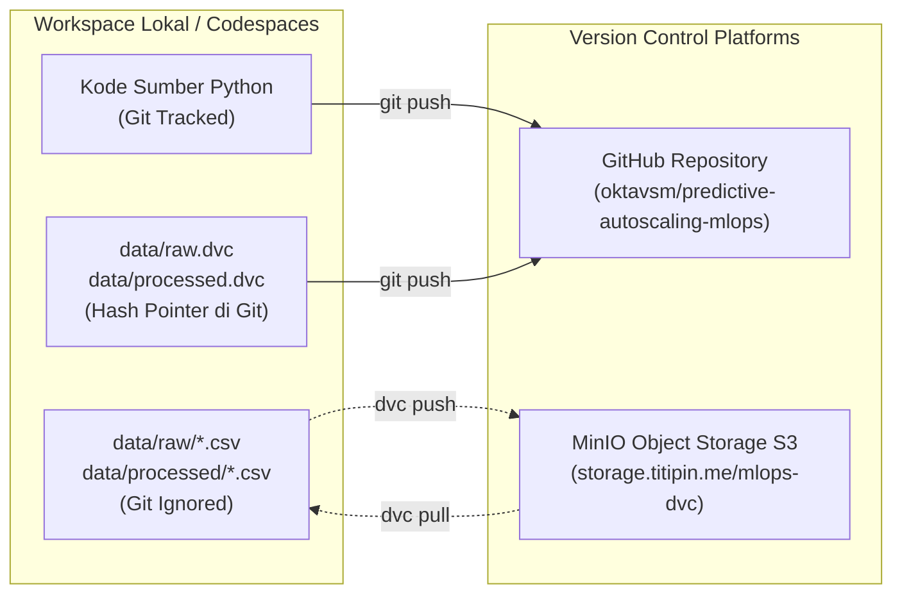

# Data Versioning with DVC & MinIO S3 (LK-05)

> **Modul:** LK-05 — Manajemen Data Versioning Menggunakan DVC  
> **Remote Storage:** MinIO S3 (`https://storage.titipin.me/mlops-dvc`)  
> **Status:** ✅ Selesai, Teruji & Terhubung ke Cluster AWS

---

## 1. Mengapa Versioning Data Diperlukan? (Latar Belakang)

Dalam rekayasa perangkat lunak tradisional, Git digunakan untuk melacak riwayat baris kode sumber. Namun, pada sistem **MLOps (Machine Learning Operations)**:
1. **Ukuran Berkas:** Data telemetri time-series dan artefak model berukuran relatif besar dan biner. Menyimpan file data langsung di Git menyebabkan *repository bloating* (repositori membengkak, proses `git clone` menjadi sangat lambat).
2. **Keterikatan Model & Data (Lineage):** Setiap performa model pembelajaran mesin (misal MAE atau RMSE) terikat erat pada versi dataset spesifik yang digunakan saat pelatihan. Jika distribusi data berubah (*data drift*), kita harus mampu mereplikasi dan mengaudit versi data eksak masa lalu (*reproducibility*).

**Solusi MLOps:** Memisahkan penyimpanan kode dan penyimpanan data menggunakan **DVC (Data Version Control)**:
* **Git:** Hanya menyimpan berkas penunjuk kecil berbasis teks (`data/raw.dvc` dan `data/processed.dvc`) yang berisi hash MD5 dataset.
* **MinIO Object Storage:** Menyimpan data biner CSV/Parquet secara fisik di bucket `mlops-dvc` pada cluster Kubernetes K3s AWS (`storage.titipin.me`).



---

## 2. Arsitektur & Konfigurasi Remote MinIO S3

Remote storage dikonfigurasi menargetkan instance MinIO privat yang berjalan di namespace `titipin` pada cluster K3s AWS.

### 2.1 Konfigurasi DVC (`.dvc/config`)
Berkas konfigurasi publik yang tercatat di Git:
```ini
[core]
    remote = minio
['remote "minio"']
    url = s3://mlops-dvc
    endpointurl = https://storage.titipin.me
```

### 2.2 Isolasi Kredensial (`.dvc/config.local`)
Demi keamanan, kredensial otentikasi disimpan pada `.dvc/config.local` yang secara otomatis diabaikan (*ignored*) oleh Git:
```ini
['remote "minio"']
    access_key_id = <MINIO_ROOT_USER>
    secret_access_key = <MINIO_ROOT_PASSWORD>
```
*(Nilai kredensial aktual tersimpan aman di `.env.secrets` lokal yang strictly gitignored).*

### 2.3 Kompatibilitas Checksum S3
Versi AWS SDK / botocore modern mengaktifkan kalkulasi checksum trailer (`CRC64NVME`) secara default. Untuk kompatibilitas optimal dengan gateway MinIO, parameter berikut otomatis diaktifkan pada eksekusi DVC:
```bash
export AWS_REQUEST_CHECKSUM_CALCULATION=when_required
export AWS_RESPONSE_CHECKSUM_VALIDATION=when_required
```
*(Parameter ini sudah disematkan ke dalam target `make dvc-push` dan `make dvc-pull`).*

---

## 3. Alur Kerja Versioning & Bukti Continual Learning

Pipeline data telah melalui dua siklus versioning resmi:

### Versi 1: Baseline Dataset (`v1.0-data`)
* **Waktu:** 30 September 2026
* **Cakupan Data:** Data awal hasil workload sequence LK-03 & LK-04 (5 file mentah, 3 file processed).
* **Pointer Hash:**
  * `data/raw.dvc` ➔ `f5c7e0e74874eee2184e610e140f5084.dir` (49.7 KB)
  * `data/processed.dvc` ➔ `81228fb7720d0e37aa589d98fe4356e5.dir` (47.3 KB)
* **Tag Git:** `v1.0-data`

### Versi 2: Penambahan Batch Telemetri Baru (`v2.0-data`)
* **Waktu:** 30 September 2026 (Simulasi Continual Learning)
* **Aktivitas:** Pengambilan data telemetri baru dari Prometheus HTTP API via `ingest_data.py` dan pembersihan via `preprocess.py`.
* **Pointer Hash Diperbarui:**
  * `data/raw.dvc` ➔ `b72a5376a58b361528b426d5270e6b57.dir` (54.5 KB, 6 file)
  * `data/processed.dvc` ➔ `6bb279246f63ba1bc8dc0356c8ec417b.dir` (55.9 KB, 4 file)
* **Tag Git:** `v2.0-data`

---

## 4. Audit Perubahan Data Menggunakan `dvc diff`

Ketika versi dataset beralih dari `v1.0-data` ke `v2.0-data`, perbedaan data dapat diaudit secara transparan menggunakan perintah:

```bash
make dvc-diff
# atau: dvc diff
```

**Output Audit `dvc diff`:**
```text
Added:
    data/processed/metrics_processed_20260930_124507.csv
    data/raw/metrics_20260930_124503.csv

Modified:
    data/processed/
    data/raw/

files summary: 2 added
```

Perbedaan commit pada Git hanya mencatat perubahan 6 baris pointer teks hash:
```diff
diff --git a/data/raw.dvc b/data/raw.dvc
- md5: f5c7e0e74874eee2184e610e140f5084.dir
- size: 49781
- nfiles: 5
+ md5: b72a5376a58b361528b426d5270e6b57.dir
+ size: 54597
+ nfiles: 6
```

---

## 5. Panduan Pengambilan Data bagi Kontributor Baru

Bagi siapa pun yang baru melakukan `git clone` terhadap repositori ini:

```bash
# 1. Clone repositori
git clone https://github.com/oktavsm/predictive-autoscaling-mlops.git
cd predictive-autoscaling-mlops

# 2. Setup virtual environment & dependencies
make install

# 3. Download seluruh dataset biner dari MinIO S3
make dvc-pull

# 4. Verifikasi status sinkronisasi
make dvc-status
# Output diharapkan: "Data and pipelines are up to date."
```

---

## 6. Panduan Screenshot untuk Lembar Kerja LK-05

Bagi mahasiswa, berikut adalah perintah terminal yang dapat dijalankan untuk mengambil screenshot bukti laporan ke dosen:

1. **Screenshot 1 — Inisialisasi & Konfigurasi Remote DVC:**
   ```bash
   dvc remote list
   cat .dvc/config
   ```
   📸 *Menunjukkan remote default adalah `minio` dengan endpoint `https://storage.titipin.me`.*

2. **Screenshot 2 — Status Sinkronisasi DVC & MinIO:**
   ```bash
   make dvc-status
   ```
   📸 *Menunjukkan seluruh dataset sinkron dengan cloud storage.*

3. **Screenshot 3 — Audit Continual Learning (`dvc diff`):**
   ```bash
   make dvc-diff
   ```
   📸 *Menunjukkan penambahan batch dataset baru tanpa membebani ukuran Git.*
