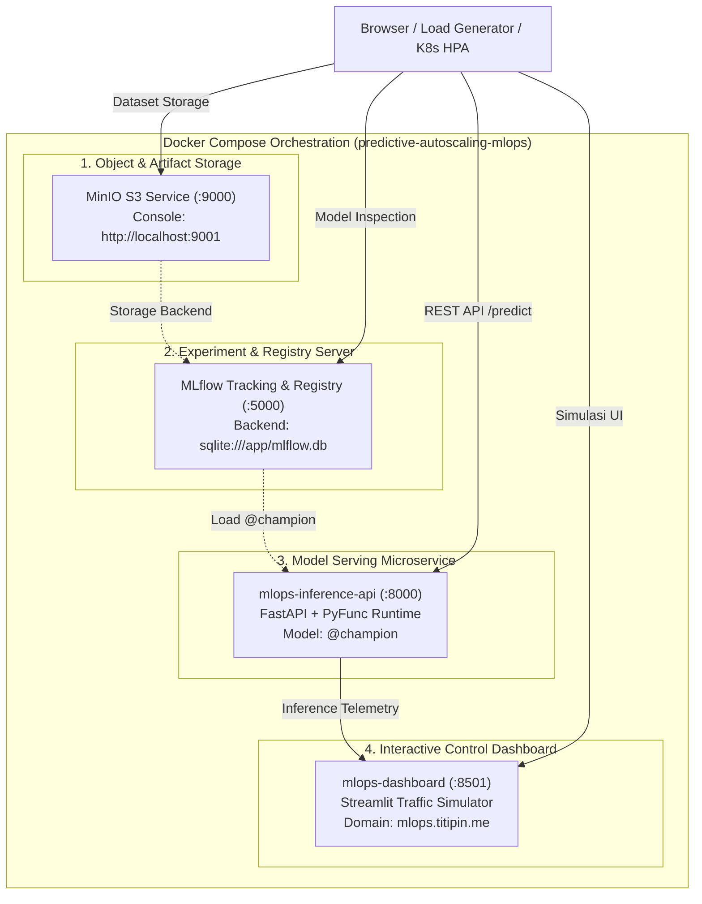

# Multi-Service MLOps Orchestration with Docker Compose
> **Stack Definition:** `docker-compose.yaml`  
> **Microservices:** MinIO S3, MLflow Server, FastAPI Inference API, Streamlit Dashboard  
> **Networking:** Isolated Bridge Network (`mlops-network`) with Healthcheck Dependencies  

---

## 1. Arsitektur Layanan Mikro Terintegrasi

Sistem mengorkestrasi 4 kontainer utama dalam jaringan terisolasi `mlops-network`:



---

## 2. Rincian 4 Layanan Mikro (Microservices Specification)

| Layanan | Nama Kontainer | Port Terbuka | Teknologi Utama | Peran dalam Siklus MLOps |
| :--- | :--- | :---: | :--- | :--- |
| **`minio`** | `mlops-minio` | `9000`, `9001` | MinIO S3 Object Store | Menyimpan dataset telemetri DVC (`v2.0-data`) & artefak biner |
| **`mlflow-server`** | `mlops-mlflow-server` | `5000` | MLflow 3.16.1 (Python 3.12) | Tracking eksperimen & Model Registry (`predictive-autoscaler`) |
| **`mlops-inference-api`** | `mlops-inference-api` | `8000` | FastAPI + Uvicorn | Melayani inferensi beban trafik t+60s & rekomendasi replika pod |
| **`mlops-dashboard`** | `mlops-dashboard` | `8501` | Streamlit 1.42.0 | Dasbor interaktif simulasi lonjakan trafik & monitoring pod |

---

## 3. Pengecekan Kesehatan & Urutan Booting (*Healthcheck Order*)

Untuk menghindari *race condition* (misalnya API inferensi mencoba memuat model sebelum server MLflow aktif), Docker Compose menerapkan kontrol dependensi berbasis status kesehatan (*condition: service_healthy*):

1. **Tahap 1:** Kontainer `minio` dan `mlflow-server` dinyalakan terlebih dahulu.
2. **Tahap 2:** Pengecekan *healthcheck* memastikan port 9000 (MinIO) dan port 5000 (MLflow) merespons status `healthy`.
3. **Tahap 3:** Kontainer `mlops-inference-api` dinyalakan, memuat model `@champion` dari registry, dan memverifikasi kesiapan endpoint `/health`.
4. **Tahap 4:** Kontainer `mlops-dashboard` aktif dan terhubung ke API inferensi internal.

---

## 4. Instruksi Pengoperasian

### 1. Menjalankan Seluruh Layanan (Detached Mode)
```bash
docker compose up -d
```

### 2. Memeriksa Status Seluruh Kontainer
```bash
docker compose ps
```
Seluruh 4 kontainer wajib berstatus **`Up (healthy)`**.

### 3. Pengujian Endpoint REST API Inferensi

#### a. Health Check:
```bash
curl -s http://localhost:8000/health | jq .
```
*Respons yang Diharapkan:*
```json
{
  "status": "healthy",
  "service": "predictive-autoscaler-inference",
  "model_ready": true,
  "model_name": "predictive-autoscaler",
  "model_alias": "champion",
  "target_rps_per_pod": 10.0,
  "replica_bounds": {"min": 1, "max": 4}
}
```

#### b. Prediksi Beban Trafik & Rekomendasi Pod (`/predict`):
```bash
curl -s -X POST http://localhost:8000/predict \
  -H "Content-Type: application/json" \
  -d '{
    "request_rate": 28.5,
    "php_cpu_cores": 0.70,
    "p95_latency_seconds": 0.085,
    "php_memory_mb": 145.0
  }' | jq .
```

#### c. Adapter Keputusan Penskalaan Kubernetes (`/scale-decision`):
```bash
curl -s -X POST http://localhost:8000/scale-decision \
  -H "Content-Type: application/json" \
  -d '{
    "request_rate": 35.0,
    "php_cpu_cores": 0.85,
    "p95_latency_seconds": 0.120,
    "php_memory_mb": 160.0
  }' | jq .
```

### 4. Menghentikan Seluruh Layanan
```bash
docker compose down
```
Untuk menghapus volume data MinIO:
```bash
docker compose down -v
```
