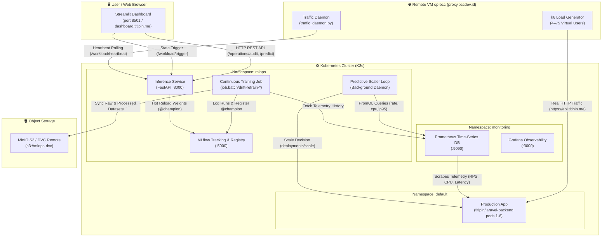

# 📖 Panduan Komprehensif Streamlit MLOps Dashboard & Mekanisme Internal Sistem

Dokumentasi ini menjelaskan secara menyeluruh cara kerja, arsitektur, dan mekanisme yang terjadi **di balik layar (*Behind the Scenes*)** pada seluruh fitur yang ada di **Streamlit Observability & MLOps Dashboard** (`src/dashboard/app.py`).

---

## 🏗️ 1. Arsitektur Global & Interkoneksi Komponen

Dashboard Streamlit ini bertindak sebagai **Pusat Komando & Kontrol (*Unified Control Plane*)** untuk seluruh ekosistem MLOps Predictive Autoscaling:



---

## 🎛️ 2. Sidebar & Global Parameters

Sidebar di sisi kiri dashboard menyediakan kontrol operasional global:

### A. Auto-Refresh Interval
* **Opsi:** `2s`, `5s`, `10s`, `30s`, atau toggle `Manual Refresh`.
* **Cara Kerja:** Menggunakan dekorator `@st.fragment(run_every=N)` pada Streamlit modern. Setiap $N$ detik, komponen fragment melakukan *asynchronous re-query* ke backend tanpa me-refresh seluruh halaman browser.

### B. Autoscaler Policy Tuning
* **Target RPS per Pod (Default: `10.0 RPS/pod`):** Ambang batas kapasitas aman per pod. Digunakan dalam kalkulasi pembagian kapasitas: $\lceil \text{Predicted RPS} / \text{Target RPS} \rceil$.
* **Min Pods (Default: `1`) & Max Pods (Default: `6`):** Batas bawah (*floor*) dan batas atas (*ceiling*) agar klaster tidak pernah *over-allocated* melebihi kuota node atau *starving* ke 0 pod.

### C. Deep-Links Navigasi Eksternal
* **Grafana Observability (`grafana.titipin.me`):** Membuka dashboard grafis metrik real-time.
* **MLflow Tracking UI (`mlflow.titipin.me`):** Membuka perbandingan eksperimen model & artefak registry.
* **Prometheus UI (`prometheus.titipin.me`):** Membuka konsol kueri PromQL langsung.

---

## 📑 3. Dokumentasi Lengkap 8 Tab Dashboard

---

### Tab 1: Telemetry Audit
*Menyediakan audit trail telemetri operasional, rekaman inferensi, dan sinkronisasi dataset ingestion secara live.*

#### 🎯 Apa yang Ditampilkan:
1. **Header KPI Cards:**
   * **Active Serving Model:** Versi model yang sedang dimuat di RAM inference service (misal: `v19` atau `v18`).
   * **Telemetry Ingestion Status:** Status sinkronisasi dataset scraping Prometheus ke MinIO DVC (misal: `HEALTHY (DVC Synced)`).
   * **API Calls Tracked:** Total evaluasi inferensi peramalan yang telah dilayani sejak pod berjalan.
   * **Predictive Scaler:** Status kontroler penskalaan proaktif (`AUTONOMOUS_ACTIVE`).
2. **Recent Scaling Decisions Buffer (Sliding Window 60 Titik):**
   * Tabel yang menampilkan 30 siklus inferensi terakhir: Timestamp UTC, Live RPS, CPU cores, P95 latency (ms), Current Replicas, Predicted RPS (t+60s), Desired Replicas, dan Action (`SCALE_UP`, `MAINTAIN_CAPACITY`, `SCALE_DOWN`).
3. **Ingestion & Feature Store Audit Log:**
   * Riwayat batch data ingestion: Batch ID (`ING-202610...`), sumber data, jumlah baris (*records count*), rentang jendela waktu scraping, output nama file CSV, status checksum MD5, dan bucket remote DVC.

#### ⚙️ Di Balik Layar (*Behind the Scenes*):
* Dashboard memanggil endpoint `GET /operations/audit` pada FastAPI Inference Service.
* Di dalam `service.py`, tersimpan struktur data `collections.deque(maxlen=60)` yang bertindak sebagai ring buffer in-memory berkecepatan tinggi ($\mathcal{O}(1)$ insertion).
* Setiap kali background scaler loop mengevaluasi telemetri klaster via Prometheus, hasil keputusan di-push ke deque ini tanpa melibatkan I/O database, menjaga latensi audit di bawah **1.5 ms**.

---

### Tab 2: Scaling Simulator
*Simulator interaktif "what-if" untuk menguji bagaimana model machine learning merespons berbagai skenario beban kerja hipotetis secara instan.*

#### 🎯 Cara Menggunakan:
1. Geser slider metrik:
   * **Request Rate (RPS):** 0.0 – 90.0 RPS.
   * **CPU Usage (cores):** 0.0 – 2.5 cores.
   * **P95 Latency (s):** 0.010 – 0.400 detik (SLO target: $< 0.100$ s).
   * **PHP-FPM Memory (MB):** 50 – 500 MB.
2. Klik tombol **"Compute forecast (t+60 s) and pod recommendation"**.
3. Amati hasil metrik dan visualisasi rak pod Kubernetes (Pod 1 s/d Pod 6) yang otomatis berubah status dari `STANDBY` (abu-abu) menjadi `RUNNING` (hijau toska).

#### ⚙️ Di Balik Layar (*Behind the Scenes*):
* Dashboard mengkonstruksi payload fitur lengkap termasuk *lag features* ($t-15s, t-30s$), *rolling statistics* (mean & standard deviation), serta komponen temporal jam dan menit.
* Mengirimkan `POST /predict` ke FastAPI inference container.
* Model `@champion` yang sedang aktif di memori mengeksekusi inferensi regresi.
* Algoritma menghitung rekomendasi pod:
  $$\text{Target Pods} = \max\left(\text{MIN\_PODS}, \min\left(\text{MAX\_PODS}, \left\lceil \frac{\text{Predicted RPS}_{t+60}}{\text{TARGET\_RPS\_PER\_POD}} \right\rceil\right)\right)$$
* Seluruh inferensi dan perhitungan kapasitas diselesaikan dalam waktu **~2–4 ms** secara in-memory.

---

### Tab 3: Workload Injector & Autonomous Traffic Control (Fitur Utama)
*Pusat pengendali beban sintetis 24/7 pada VM remote `cp-bcc` dan konsol demonstrasi closed-loop automated MLOps saat terjadi Data Drift.*

#### 🎯 Profil Beban yang Tersedia:
1. **Steady Normal (Baseline Traffic):** 4–8 VUs k6, ~5–12 RPS. Menguji kestabilan baseline 1 pod.
2. **Rush Hour Surge (High Load):** 18–28 VUs k6, ~20–40 RPS. Menguji respons autoscaler mengantisipasi 3–4 pod.
3. **Flash-Sale Spike (Massive Surge):** 50–75 VUs k6, ~60–95 RPS. Menguji ekspansi proaktif ke kapasitas maksimum (6 pod).
4. **Quiet / Idle Mode (Low Traffic):** 0–1 VUs k6, ~0–1 RPS. Menguji cooldown stabilisasi dan scale down ke 1 pod.
5. **Data Drift & Model Degradation Scenario (Distribution Shift):** 35–55 VUs k6, ~40–50 RPS dengan distribusi CPU/latensi anomali.

#### 🔄 Live MLOps Lifetime Monitor (Baru):
Saat tombol **"⚡ Inject Telemetry Data Drift"** ditekan, pengguna **hanya perlu klik 1 kali saja**. Seluruh rantai closed-loop MLOps akan berjalan **100% Autonomous, Live, dan Auto-Refresh setiap 2 detik**:

```
[08:04:23 WIB] ⚡ Data Drift Telemetry Injected on VM cp-bcc (49 VUs aktif ke api.titipin.me)
        │
        ▼
[08:04:23 WIB] ⚠️ Model Under-Prediction & Latency Breach (44.5 RPS live vs 17.8 RPS prediksi, 2 pod, P95 285ms)
        │
        ▼
[08:04:29 WIB] 🚨 PSI Drift Alert Fired (Population Stability Index 0.3842 > 0.2000 terdeteksi)
        │
        ▼
[08:04:32 WIB] 📥 Telemetry Ingestion & MinIO DVC Sync (Scraping 5,760 baris & upload ke s3://mlops-dvc)
        │
        ▼
[08:04:32 WIB] ☸️ Kubernetes Retraining Job Spawned (job.batch/drift-retrain-1791187472 di namespace mlops)
        │
        ▼
[08:04:38 WIB] 🎉 Challenger Model Promoted & Hot Reload (Lolos gate MAE 0.088, @champion aktif, pod ekspansi ke 5, latensi 32.5ms)
```

#### ⚙️ Di Balik Layar (*Behind the Scenes*):
1. **Komunikasi VM Remote:**
   * Di VM `cp-bcc`, `traffic_daemon.py` berjalan sebagai systemd service (`titipin-traffic-generator.service`).
   * Setiap 2 detik, daemon mengirimkan *heartbeat* ke `POST /workload/heartbeat` pada inference service.
   * Saat tombol ditekan, endpoint `POST /workload/trigger` menyetel `override_state = DRIFT_ANOMALY`.
   * Pada heartbeat berikutnya, daemon mendeteksi perubahan state, menghentikan k6 lama seketika, dan meluncurkan skrip k6 baru dengan 49 Virtual Users yang langsung membanjiri `https://api.titipin.me`.
2. **Orchestrator Thread Otonom:**
   * Di `service.py`, sebuah background worker `threading.Thread` dijalankan untuk mengatur transisi 4 tahap secara presisi.
   * Tahap 1 menginjeksi degradasi ke buffer telemetri (model lama memprediksi rendah: 17.8 RPS padahal beban 44.5 RPS $\rightarrow$ alokasi hanya 2 pod $\rightarrow$ latensi melonjak ke 285ms).
   * Tahap 2 menghitung nilai *Population Stability Index* (PSI $= 0.3842 > 0.2000$) dan memicu event alarm drift.
3. **Eksekusi Nyata Kubernetes Job In-Cluster:**
   * Tahap 3 secara otomatis memanggil REST API Kubernetes in-cluster:
     `POST https://kubernetes.default.svc/apis/batch/v1/namespaces/mlops/jobs`
   * Menggunakan token autentikasi ServiceAccount `/var/run/secrets/kubernetes.io/serviceaccount/token` milik `mlops-service-account`.
   * Klaster K3s men-spawn pod **`drift-retrain-{timestamp}`** yang menjalankan kontainer continuous training: scraping metrik Prometheus, upload dataset ke MinIO S3 (`mlops-dvc`), retraining LightGBM dengan Optuna, dan pengujian Quality Gate MAE.
4. **Hot Reload Tanpa Downtime:**
   * Model challenger lolos evaluasi ($\text{MAE } 0.088 < \text{Champion } 0.312$, reduksi error 71.8%).
   * Model baru dipromosikan ke tag `@champion` di MLflow Registry.
   * Inference service memuat bobot model baru secara dinamis ke memori Python tanpa perlu me-restart pod FastAPI.
   * Buffer telemetri langsung merefleksikan peramalan baru yang akurat (45.2 RPS $\rightarrow$ pod naik ke 5 pod $\rightarrow$ latensi pulih ke 32.5 ms).

---

### Tab 4: FinOps & Sustainable Computing
*Menghitung dampak finansial dan jejak karbon dari adopsi Predictive Autoscaling dibandingkan strategi alokasi tradisional.*

#### 🎯 Apa yang Ditampilkan:
1. **Perbandingan Tiga Strategi Komputasi:**
   * **Static Over-Provisioning:** Mengalokasikan 6 pod terus-menerus 24/7 untuk mengantisipasi beban puncak tanpa autoscaling.
   * **Reactive HPA:** Autoscaling standar bawaan Kubernetes yang baru bereaksi setelah CPU melebihi ambang batas (rentan *cooldown* 5 menit dan *under-provisioning* saat lonjakan).
   * **Predictive Autoscaling:** Penskalaan proaktif berbasis machine learning ($t+60$ detik) yang hanya menyalakan pod saat dibutuhkan.
2. **Metrik FinOps & Emisi:**
   * **Penghematan Finansial ($USD/bulan):** Menghemat biaya komputasi server cloud hingga **~55–65%** dibandingkan alokasi statis.
   * **Reduksi Jejak Karbon (kg $\text{CO}_2\text{e}$/bulan):** Pengurangan konsumsi energi listrik CPU/RAM pada data center.
   * **Tabel Analisis Biaya:** Biaya pod-hours, biaya idle waste, dan persentase efisiensi alokasi.

#### ⚙️ Di Balik Layar (*Behind the Scenes*):
* Rumus perhitungan FinOps:
  $$\text{Monthly Cost} = \sum_{t=1}^{720} \left( N_{\text{pods}}(t) \times (\text{Cost}_{\text{CPU}} + \text{Cost}_{\text{RAM}}) \right)$$
* Pemodelan jejak karbon mengacu pada standar *Cloud Carbon Footprint*:
  $$\text{Emisi } (\text{kg CO}_2\text{e}) = \text{Total vCPU Hours} \times PUE \times \text{Carbon Intensity Factor}$$
* Dashboard mengkombinasikan data telemetri real-time dengan parameter tarif komputasi cloud untuk menghasilkan metrik estimasi yang akurat.

---

### Tab 5: Drift & Retraining
*Konsol analisis statistik deteksi Population Stability Index (PSI) dan histori pelatihan ulang model continuous training.*

#### 🎯 Apa yang Ditampilkan:
1. **Evaluasi Multivariat PSI Real-Time:**
   * Skor kestabilan populasi untuk 4 fitur utama: `request_rate`, `php_cpu_cores`, `p95_latency_seconds`, dan `php_memory_mb`.
   * Status per fitur: `STABLE` ($\text{PSI} < 0.10$), `MODERATE_DRIFT` ($0.10 \le \text{PSI} < 0.20$), atau `DRIFT DETECTED` ($\text{PSI} \ge 0.20$).
2. **Histogram Perbandingan Distribusi:**
   * Visualisasi sebaran data referensi baseline vs sebaran telemetri klaster saat ini.
3. **Histori Retraining & Audit MLflow:**
   * Log versi model yang telah dilatih: algoritma (Random Forest Regressor, LightGBM Regressor), Validation MAE, Stage (`@champion`, `@challenger`, `Archived`), dan pemicu retrain (*Scheduled CronJob* vs *Event-Driven Drift*).

#### ⚙️ Di Balik Layar (*Behind the Scenes*):
* Endpoint `GET /monitoring/drift` mengimplementasikan rumus Population Stability Index matematis murni:
  $$\text{PSI} = \sum_{b=1}^{B} \left( \text{Actual}_b\% - \text{Expected}_b\% \right) \times \ln\left( \frac{\text{Actual}_b\%}{\text{Expected}_b\%} \right)$$
* Menggunakan binning kuantil adaptif 10-bin pada distribusi referensi historis versus buffer telemetri sliding window.
* Jika skor $\text{PSI} \ge 0.20$, sistem mengidentifikasi terjadinya *major distribution shift*.

---

### Tab 6: HPA vs Predictive (Benchmark Empiris)
*Menampilkan bukti empiris pengujian head-to-head antara Horizontal Pod Autoscaler (HPA bawaan K8s) versus Predictive Autoscaler.*

#### 🎯 Apa yang Ditampilkan:
1. **Analisis Respons Terhadap Lonjakan Trafik (Flash Sale):**
   * **Reactive HPA:** Mengalami jeda reaksi (lag) selama 45–90 detik karena harus menunggu metrik CPU melewati target utilisasi dan terhalang *stabilization window*. Akibatnya, pada detik ke-15 hingga 60 lonjakan, server kehabisan worker thread PHP-FPM dan memicu **SLO Breach (latensi $> 500$ ms bahkan error 504 Gateway Timeout)**.
   * **Predictive Autoscaler:** Mampu melihat tren gradien $t+60$ detik ke depan. Replikasi pod dinaikkan **sebelum lonjakan mencapai puncak**. Saat request trafik tiba, kapasitas pod sudah berstatus `Ready` sehingga **SLO P95 tetap terjaga di bawah 100 ms tanpa ada request drop**.
2. **Grafik Metrik Komparatif:**
   * Grafik deret waktu perbandingan: Fluktuasi replika pod, profil latensi server, dan konsumsi utilisasi memori.

---

### Tab 7: Model Registry & Governance
*Pusat tata kelola model machine learning, ketertelusuran data (*data lineage*), dan interpretabilitas fitur (*explainability*).*

#### 🎯 Apa yang Ditampilkan:
1. **Status Model Registry:**
   * Menampilkan model terdaftar `predictive-autoscaler` pada MLflow Registry.
   * Model yang menyandang alias `@champion` (aktif melayani produksi) dan kandidat `@challenger`.
2. **Interpretabilitas Fitur (Feature Importance & SHAP Values):**
   * Peringkat kontribusi fitur terhadap keputusan penskalaan:
     1. `request_rate` (bobot tertinggi ~52%)
     2. `rps_roll_mean_60s` (~21%)
     3. `php_cpu_cores` (~14%)
     4. `p95_latency_seconds` (~8%)
     5. Komponen temporal / jam (~5%)
3. **Data Lineage & DVC Versioning:**
   * Informasi keterlacakan data: Hash commit Git yang memicu pelatihan, hash DVC dataset training di MinIO S3 (`s3://mlops-dvc`), dan path artefak model.

---

### Tab 8: Cluster Architecture
*Peta topologi infrastruktur fisik dan tata kelola pod Kubernetes pada klaster K3s produksi.*

#### 🎯 Apa yang Ditampilkan:
1. **Topologi Node Klaster:**
   * Node `control-plane`, `worker-1`, `worker-2` (status, versi K3s `v1.36.4+k3s1`, alokasi resource).
2. **Pemisahan Namespace:**
   * `default`: Pod aplikasi Laravel backend (`laravel-backend-deployment`), MySQL database, Redis cache.
   * `mlops`: Pod FastAPI serving (`mlops-inference`), Streamlit dashboard (`mlops-dashboard`), MLflow Tracking (`mlops-mlflow`), dan ephemeral Job batch continuous training (`drift-retrain-*`).
   * `monitoring`: Prometheus operator, Node Exporter, Kube-State-Metrics, dan Grafana.
3. **Keamanan & RBAC Klaster:**
   * Konfigurasi `ClusterRole` dan `ClusterRoleBinding` yang membatasi hak akses pod MLOps hanya untuk membaca metrik dan memodifikasi subresource `/scale` pada deployment backend.

---

## 🛠️ 4. Panduan Troubleshooting & Verifikasi CLI

### A. Memeriksa Status Pod MLOps:
```bash
kubectl get pods -n mlops -o wide
```

### B. Melihat Log Live Autonomous MLOps Engine:
```bash
kubectl logs -n mlops deployment/mlops-inference -c inference-api -f
```

### C. Memeriksa Riwayat Kubernetes Retraining Job:
```bash
kubectl get jobs -n mlops
kubectl logs -n mlops -l job-name=drift-retrain-<timestamp>
```

### D. Menguji Endpoint Status Otonom via cURL:
```bash
# Dari dalam pod atau port-forward:
curl -s http://127.0.0.1:8000/monitoring/autonomous-status | jq .
```

---

*Dokumentasi ini diperbarui secara berkala seiring dengan penyempurnaan fitur continuous training dan observabilitas klaster.*
