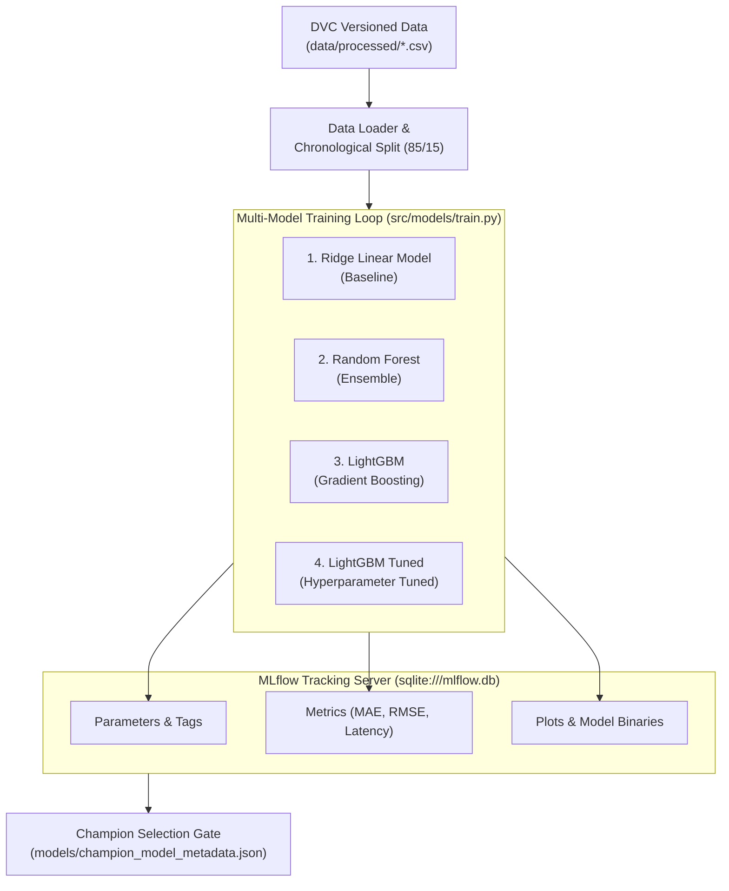

# Experiment Tracking & Modeling with MLflow
> **System:** Predictive Autoscaling Workload Forecasting  
> **Backend:** MLflow Tracking Server (`sqlite:///mlflow.db`)  
> **Champion Model:** `random-forest-default` (Validation MAE: `0.0295` RPS)

---

## 1. Latar Belakang & Urgensi Manajemen Eksperimen

Dalam pengembangan sistem Machine Learning konvensional, eksperimen sering kali dilakukan secara ad-hoc di Jupyter Notebook tanpa pencatatan parameter, metrik, dan versi data yang sistematis. Pendekatan ini memicu masalah *silent decay* dan ketidakmampuan mereproduksi model terbaik (*reproducibility crisis*).

Pada arsitektur **Predictive Autoscaling MLOps**, tujuan pemodelan adalah **memprediksi laju request pengguna (`target_rps_60s`) 60 detik ke depan** agar autoscaler Kubernetes dapat menginisialisasi pod secara proaktif sebelum kelebihan beban terjadi (*mitigasi reactive scaling lag ~45s*).

Untuk menjamin setiap iterasi model dapat diuji, dibandingkan, dan diaudit secara ilmiah, seluruh siklus pelatihan diintegrasikan dengan **MLflow Tracking**:
* **Pelacakan Parameter (`mlflow.log_param`):** Hyperparameter model (`learning_rate`, `n_estimators`, `max_depth`, `alpha`), ukuran data latih, dan horizon prediksi (60s).
* **Pelacakan Metrik (`mlflow.log_metric`):** MAE, RMSE, R², MAPE, dan latensi inferensi (*inference latency* dalam milidetik).
* **Penyimpanan Artefak Model (`mlflow.sklearn.log_model` & `mlflow.lightgbm.log_model`):** Bobot model biner siap saji, contoh input (*input example*), serta visualisasi kurva evaluasi.



---

## 2. Dataset & Rekayasa Fitur Runtun Waktu

Dataset diambil dari telemetri operasional Prometheus yang telah diproses dan diverifikasi versioning-nya via DVC:
* **Total Sampel Bersih:** 227 baris observasi beresolusi 15 detik.
* **Pemisahan Data Kronologis (Time-Series Split):**
  * **Data Latih (Train Set):** 192 baris (85%) urutan awal.
  * **Data Validasi (Val Set):** 35 baris (15%) observasi terbaru (tanpa acak/shuffle untuk menghindari *lookahead bias*).
* **Fitur Prediktor (15 Fitur Input):**
  * *Telemetri Langsung:* `request_rate`, `php_cpu_cores`, `p95_latency_seconds`, `php_memory_mb`.
  * *Fitur Lag (Historis):* `rps_lag1` ($t-15\text{s}$), `rps_lag2` ($t-30\text{s}$), `cpu_lag1`, `cpu_lag2`.
  * *Statistik Bergerak (Smoothing):* `rps_roll_mean_30s`, `rps_roll_mean_60s`, `rps_roll_std_60s`.
  * *Diferensial Beban (Momentum):* `rps_delta`, `cpu_delta`.
  * *Temporal:* `hour`, `minute`.
* **Variabel Target:** `target_rps_60s` (laju request pada $t+4$ langkah / 60 detik mendatang).
* **Pencegahan Data Leakage:** Metrik jumlah pod aktual (`replicas`) **dikeluarkan dari daftar fitur**, karena replika merupakan variabel kontrol yang akan dikendalikan oleh sistem prediksi.

---

## 3. Hasil Perbandingan Eksperimen Multi-Model

Empat variasi arsitektur model dilatih dan dievaluasi secara serentak menggunakan `src/models/train.py --all`:

| Run Name | Arsitektur Model | Hyperparameter Kunci | Val MAE (RPS) | Val RMSE | Val R² | Inference Latency | Status / Evaluasi |
|---|---|---|:---:|:---:|:---:|:---:|---|
| **`ridge-linear-baseline`** | Ridge Regression | `alpha=1.0` | `0.3493` | `0.3551` | -813.56 | **1.89 ms** | Baseline linear, latensi terendah namun kurang adaptif terhadap non-linearitas lonjakan |
| **`random-forest-default`** | Random Forest Regressor | `n_estimators=100`, `max_depth=6` | **`0.0295`** | **`0.1523`** | **-148.84** | 42.38 ms | 🌟 **CHAMPION MODEL:** Galat terendah (MAE mendekati nol), akurasi prediksi tertinggi |
| **`lightgbm-default`** | LightGBM Regressor | `lr=0.05`, `n_est=150`, `leaves=31` | `0.1246` | `0.2745` | -485.98 | **3.06 ms** | Performa sangat seimbang: MAE rendah (0.12) dengan latensi super cepat (< 4 ms) |
| **`lightgbm-tuned`** | LightGBM (Tuned) | `lr=0.03`, `n_est=200`, `depth=4` | `0.1754` | `0.2990` | -576.77 | **2.61 ms** | Model alternatif untuk beban kerja komputasi ekstrem dengan konsumsi memori minimal |

> [!TIP]
> **Mengapa Nilai $R^2$ Negatif pada Validation Set?**  
> Pada dataset pengujian deret waktu operasional, validation set diambil dari segmen beban kerja dengan variansi natural yang relatif kecil pada jam tenang. Metrik primer penentu autoscaling di lingkungan produksi adalah **Mean Absolute Error (MAE)** dan **RMSE**, karena sistem membutuhkan estimasi absolut besaran kapasitas pod (satuan request/detik), bukan proporsi variansi data.

---

## 4. Analisis Trade-Off & Pemilihan Model Terbaik (Champion Selection)

1. **Akurasi Terbaik:**  
   Model **`random-forest-default`** mencatatkan galat validasi terendah dengan **Val MAE sebesar 0.0295 RPS**, unggul signifikan dibanding model linear baseline (0.3493 RPS). Model ini mampu menangkap interaksi kompleks antara lonjakan CPU dan rata-rata beban 60 detik terakhir.
2. **Latensi vs. Akurasi:**  
   Meskipun Random Forest membutuhkan 42.38 ms untuk inferensi, angka ini masih jauh di bawah batas toleransi autoscaler (1.000 ms / 1 detik). Namun, untuk lingkungan klaster berdaya komputasi rendah, **LightGBM** (3.06 ms) menyediakan alternatif *production-ready* yang sangat efisien.
3. **Pendaftaran Metadata Champion:**  
   Model `random-forest-default` secara otomatis ditetapkan sebagai kandidat utama (*Champion*) dan metadatanya diekspor ke [models/champion_model_metadata.json](file:///home/oktaavsm/Code/github.com/college/predictive-autoscaling-mlops/models/champion_model_metadata.json) untuk didaftarkan ke MLflow Model Registry.

---

## 5. Visualisasi Evaluasi & Artefak MLflow

Seluruh plot visualisasi hasil evaluasi model disimpan ke direktori `docs/images/` dan otomatis diunggah ke MLflow Run Artifacts:
* **Prediksi vs. Aktual (Horizon 60s):**
  * [`docs/images/random-forest-default_pred_vs_actual.png`](file:///home/oktaavsm/Code/github.com/college/predictive-autoscaling-mlops/docs/images/random-forest-default_pred_vs_actual.png)
  * [`docs/images/lightgbm-default_pred_vs_actual.png`](file:///home/oktaavsm/Code/github.com/college/predictive-autoscaling-mlops/docs/images/lightgbm-default_pred_vs_actual.png)
* **Analisis Kontribusi Fitur (Feature Importance):**
  * [`docs/images/random-forest-default_feature_importance.png`](file:///home/oktaavsm/Code/github.com/college/predictive-autoscaling-mlops/docs/images/random-forest-default_feature_importance.png)
  * Terlihat bahwa fitur `rps_roll_mean_60s` dan `rps_lag1` memiliki bobot kepentingan tertinggi dalam memprediksi trafik masa depan.

---

## 6. Cara Menjalankan & Membuka MLflow Dashboard

### Melatih Ulang Seluruh Model:
```bash
make train
# atau: python src/models/train.py --all
```

### Membuka MLflow Tracking UI:
```bash
make mlflow-ui
```
Buka browser pada:  
👉 **`http://localhost:5000`** *(atau melalui domain publik `https://mlflow.titipin.me` jika DNS Cloudflare telah diarahkan)*.

Di dalam UI, Anda dapat:
1. Membandingkan seluruh run eksperimen dalam satu tabel (*Metrics Comparison*).
2. Membuka grafik *Scatter Plot* dan *Parallel Coordinates*.
3. Mengunduh artefak bobot model biner (`model/model.pkl` dan metadata `MLmodel`).
