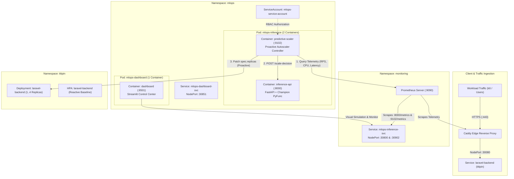

# Kubernetes Deployment & Predictive Autoscaling Controller
> **Cluster Engine:** Multi-Node K3s on AWS EC2 (`control-plane`, `worker-1`, `worker-2`)  
> **Dedicated Namespace:** `mlops`  
> **Key Capabilities:** Dual-Container Serving Engine, RBAC Controller, Proactive Scaling Algorithm  

---

## 1. Arsitektur Deployment Klaster K3s Multi-Node

Sistem inferensi dan penskalaan prediktif dideploy secara *native* pada namespace terisolasi `mlops` di atas klaster Kubernetes K3s multi-node AWS EC2 (`control-plane`, `worker-1`, `worker-2`).



---

## 2. Rincian Komponen & Manifest Kubernetes

Semua manifest tersusun secara terstruktur di direktori `infrastructure/kubernetes/mlops/` dan dapat diterapkan menggunakan Kustomize (`kubectl apply -k infrastructure/kubernetes/mlops/`):

| Berkas Manifest | Jenis Resource | Fungsi & Konfigurasi |
|---|---|---|
| `00-namespace.yaml` | `Namespace` | Mengisolasi seluruh beban kerja MLOps di namespace `mlops`. |
| `01-rbac.yaml` | `ServiceAccount`, `ClusterRole`, `ClusterRoleBinding` | Memberikan izin RBAC terkurasi (`apps/deployments/scale`, `core/pods`) agar pod scaler dapat membaca metrik replika dan memodifikasi alokasi pod target di namespace `titipin`. |
| `02-configmap.yaml` | `ConfigMap` | Menyimpan konfigurasi global: Model Champion (`predictive-autoscaler`), URL Prometheus, URL Inferensi, target namespace/deployment (`titipin/laravel-backend`), ambang batas replika (`min: 1`, `max: 4`), serta jendela *cooldown* (60s). |
| `03-inference-deployment.yaml` | `Deployment` | Pola *Dual-Container Pod*: Kontainer 1 (`inference-api`) melayani API FastAPI inferensi, Kontainer 2 (`predictive-scaler`) menjalankan daemon kontroler prediktif. |
| `04-inference-service.yaml` | `Service` (NodePort) | Mengekspos port 8000 (NodePort 30800) untuk REST API dan port 9102 (NodePort 30902) untuk metrik Prometheus. |
| `05-dashboard-deployment.yaml` | `Deployment` | Menjalankan antarmuka interaktif Streamlit Control Center dengan alokasi *resource limits* terkelola. |
| `06-dashboard-service.yaml` | `Service` (NodePort) | Mengekspos port 8501 (NodePort 30851) untuk dihubungkan ke reverse proxy Caddy (`mlops.titipin.me`). |
| `07-servicemonitor.yaml` | `ServiceMonitor` | Mengintegrasikan endpoint `/metrics` ke Prometheus Operator di namespace `monitoring` dengan label `release: monitoring`. |

---

## 3. Logika Penskalaan Prediktif vs Reaktif (*Reactive Lag Elimination*)

### Kelemahan Reactive HPA:
Horizontal Pod Autoscaler (HPA) konvensional hanya bereaksi setelah ambang batas CPU rata-rata (misal: 60%) terlampaui. Akibat proses *cold start* pod dan inisialisasi runtime PHP-FPM yang membutuhkan waktu 30–45 detik, sistem mengalami lonjakan latensi (*spike*) dan galat 502/504 Bad Gateway saat trafik datang mendadak.

### Keunggulan Predictive Autoscaler:
1. **Anticipatory Scaling (t+60s):** Kontroler mengevaluasi model ensemble Machine Learning Champion setiap 15 detik untuk memprediksi lonjakan trafik 60 detik ke depan.
2. **Immediate Scale-Up:** Jika prediksi beban $R_{\text{desired}} > R_{\text{current}}$, kontroler langsung memicu replikasi pod **sebelum** lonjakan trafik tiba di gerbang ingress, sehingga pod telah berstatus `Running (1/1)` dan siap menyerap beban penuh.
3. **Anti-Flapping Cooldown Window:** Saat beban mereda ($R_{\text{desired}} < R_{\text{current}}$), kontroler menerapkan jendela stabilisasi *cooldown* selama 60 detik guna mencegah osilasi buka-tutup pod (*thrashing*).

---

## 4. Panduan Verifikasi Operasional (Runbook)

### 4.1. Memeriksa Status Seluruh Resource di Namespace `mlops`
```bash
make k8s-status
# atau: kubectl get all,servicemonitors -n mlops
```

### 4.2. Menguji Endpoint Kesehatan Inferensi Klaster
```bash
kubectl exec -n mlops deploy/mlops-inference -c inference-api -- curl -s http://localhost:8000/health | jq .
```
*Output yang diharapkan:* `status: healthy`, `model_ready: true`, `model_alias: champion`.

### 4.3. Menguji Respon Prediksi Model Champion
```bash
kubectl exec -n mlops deploy/mlops-inference -c inference-api -- curl -s -X POST http://localhost:8000/predict \
  -H "Content-Type: application/json" \
  -d '{"request_rate": 28.5, "php_cpu_cores": 0.70, "p95_latency_seconds": 0.085, "php_memory_mb": 145.0}' | jq .
```

### 4.4. Memantau Log Siklus Kontroler Penskalaan Prediktif
```bash
make k8s-logs
# atau: kubectl logs -n mlops deploy/mlops-inference -c predictive-scaler --tail=20 -f
```

---

## 5. Ringkasan Hasil Pengujian Unit & Integrasi

Seluruh pengujian otomatis telah tervalidasi pada branch `feat/k8s-deployment`:
- **Total Test Cases:** 21 pengujian (`test_dataset.py`, `test_inference_api.py`, `test_model_registry.py`, `test_predictive_scaler.py`).
- **Status Test:** 100% Passed.
- **Code Hygiene:** 0 Lint error (Ruff check & formatting passed).
- **Cluster Deployment Status:** 100% Healthy (`mlops-inference` 2/2 Running, `mlops-dashboard` 1/1 Running, Prometheus Scrape Target UP).
