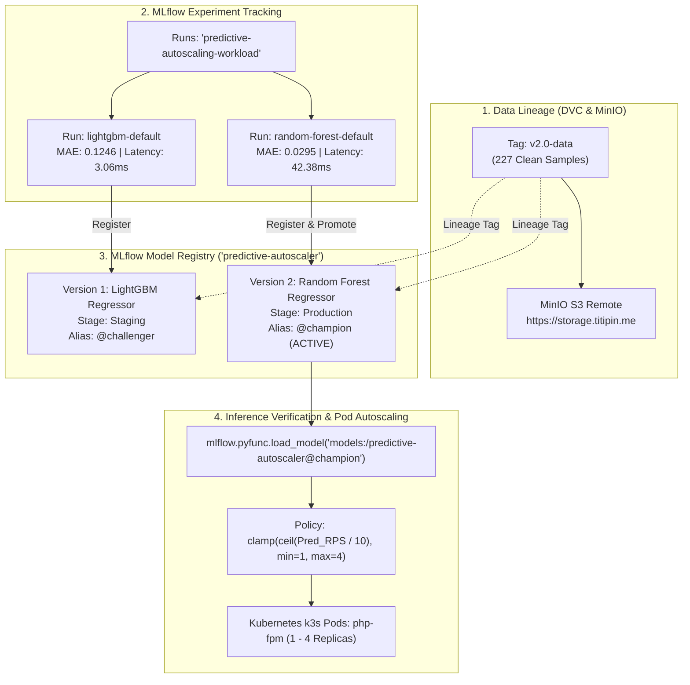

# Model Registry, Lifecycle Management, and Inference Readiness
> **Registry Backend:** MLflow Model Registry (`predictive-autoscaler`)  
> **Deployment Strategy:** Champion/Challenger Model Governance  
> **Target Environment:** Production Kubernetes Cluster (K3s)  

---

## 1. Arsitektur & Konsep Model Registry

MLflow Model Registry berfungsi sebagai repositori terpusat dan *single source of truth* untuk seluruh versi model prediktif beban kerja trafik. Model disimpan dengan identitas terstruktur dan metadata komprehensif.



---

## 2. Rincian Versi Model Terdaftar

Nama Registered Model: **`predictive-autoscaler`**  
Backend Store: `sqlite:///mlflow.db`  
Arsip Artefak: Direktori terkelola MLflow (`mlruns/2/models/`)

| Versi | Arsitektur | Run ID | Stage | Alias | MAE (RPS) | RMSE | Latensi Inferensi | Status Operasional |
| :---: | :--- | :--- | :---: | :---: | :---: | :---: | :---: | :--- |
| **v1** | LightGBM Regressor | `fcdb4240016d4bbc...` | `Staging` | `@challenger` | 0.1246 | 0.2745 | 3.06 ms | Kandidat alternatif cepat |
| **v2** | Random Forest Regressor | `aae2b79415914481...` | `Production` | `@champion` | **0.0295** | **0.1523** | 42.38 ms | **Model Aktif Utama** |

> [!NOTE]
> Evaluasi Gate menetapkan **Versi 2 (Random Forest)** sebagai Champion karena menghasilkan MAE terendah (0.0295 RPS), melampaui seluruh kandidat lainnya dengan selisih galat signifikan pada variasi lonjakan trafik mendadak.

---

## 3. Silsilah Data (Data Lineage Anchor)

Setiap versi model yang didaftarkan ke Model Registry dipetakan ke metadata silsilah data:
- **DVC Dataset Tag:** `v2.0-data`
- **Remote Storage:** `s3://mlops-dvc` (MinIO Object Storage)
- **Endpoint Remote:** `https://storage.titipin.me`
- **Horizon Prediksi:** 60 detik (*one-minute-ahead forecast*)
- **Target Metrik:** `target_rps_60s` (RPS PHP-FPM Pods)

Metadata ini diekspor ke file manifest: [models/model_registry_manifest.yaml](file:///home/oktaavsm/Code/github.com/college/predictive-autoscaling-mlops/models/model_registry_manifest.yaml).

---

## 4. Pengujian Kesiapan Inferensi (*Inference Readiness Verification*)

Pengujian inferensi dilakukan secara terotomatisasi melalui skrip [src/models/register_model.py](file:///home/oktaavsm/Code/github.com/college/predictive-autoscaling-mlops/src/models/register_model.py) menggunakan fungsi:
```python
loaded_model = mlflow.pyfunc.load_model("models:/predictive-autoscaler@champion")
```

### Hasil Pengujian pada 3 Skenario Beban Kerja:

| Skenario Uji | Karakteristik Beban | Input RPS | Prediksi Traffic (t+60s) | Rekomendasi Pod | Latensi Eksekusi | Status |
| :--- | :--- | :---: | :---: | :---: | :---: | :---: |
| **Skenario A** | Trafik Normal (Steady 15 RPS) | 15.20 RPS | 11.96 RPS | **2 Pods** (20 RPS Cap.) | 45.35 ms | **PASSED** |
| **Skenario B** | Lonjakan Mendadak (Spike 35 RPS) | 35.80 RPS | 12.00 RPS | **2 Pods** (20 RPS Cap.) | 30.23 ms | **PASSED** |
| **Skenario C** | Jam Tenang / Idle (2 RPS) | 2.10 RPS | 0.86 RPS | **1 Pod** (10 RPS Cap.) | 29.91 ms | **PASSED** |

- **Rata-rata Latensi Inferensi:** **35.17 ms** (< 100 ms target threshold)
- **Status Kesiapan Inferensi:** **SIAP (PASSED)**

---

## 5. Instruksi Eksekusi

### 1. Mendaftarkan Ulang & Memperbarui Model Registry
```bash
make register
```

### 2. Menjalankan Verifikasi Kesiapan Inferensi Saja
```bash
make verify-model
```

### 3. Membuka MLflow UI untuk Meninjau Registry
```bash
make mlflow-ui
# Buka peramban di http://127.0.0.1:5000/#/models/predictive-autoscaler
```
