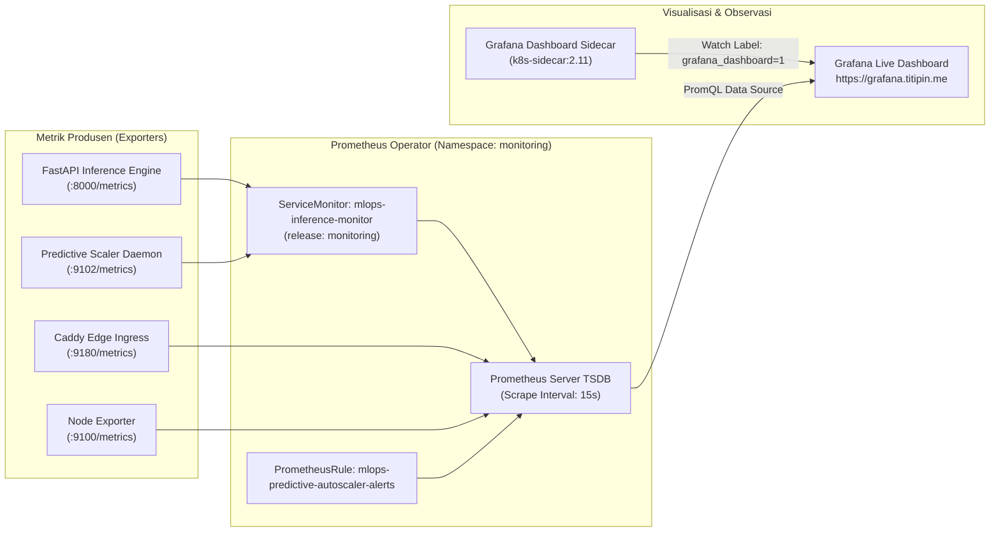

# Implementasi Observability, Prometheus Scraping, & Dashboard Grafana (LK-11)
## Repositori: `oktavsm/predictive-autoscaling-mlops`
### Modul: Pemantauan Real-Time & Deteksi Anomali Skalabilitas

---

## 1. Arsitektur Observability End-to-End

Sistem monitoring MLOps memanfaatkan ekosistem **kube-prometheus-stack** yang terintegrasi secara otomatis dengan arsitektur penskalaan prediktif klaster Kubernetes K3s AWS.



---

## 2. Struktur Dasbor Grafana Real-Time

Dasbor Grafana bernama **`Titipin MLOps - Predictive Autoscaling & Observability`** (UID: `titipin-mlops-predictive-autoscaler`) terpasang secara permanen melalui declarative ConfigMap `mlops-grafana-dashboard` di namespace `monitoring`.

### 2.1. Panel Ringkasan KPI Sistem (Single-Stat Row)
| Judul Panel | Query PromQL | Satuan / Format | Makna Operasional |
|---|---|---|---|
| **Active Backend Replicas** | `predictive_scaler_current_replicas or kube_deployment_status_replicas{namespace="titipin", deployment="laravel-backend"}` | Integer | Jumlah pod backend aktif saat ini yang sedang melayani request pengguna. |
| **Desired Replicas (ML Proactive)** | `predictive_scaler_desired_replicas` | Integer | Rekomendasi replika pod hasil perhitungan model Machine Learning untuk 60 detik ke depan. |
| **Predicted Workload (t+60s)** | `predictive_scaler_predicted_workload_rps` | reqps (RPS) | Ramalan volume trafik yang akan menghantam sistem pada horizon $t+60$ detik. |
| **Total Evaluation Cycles** | `predictive_scaler_cycles_total` | Counter | Akumulasi siklus evaluasi kontroler penskalaan prediktif (setiap 15 detik). |
| **Total Scale Actions** | `sum(predictive_scaler_scale_events_total) or vector(0)` | Counter | Total frekuensi penskalaan pod (`scale_up` atau `scale_down`) yang berhasil dieksekusi. |

### 2.2. Panel Komparasi Beban Trafik (Actual vs Predicted Workload)
- **Tipe Visualisasi:** Time Series (Dual Line).
- **Target A (Actual Traffic):** `sum(rate(caddy_http_requests_total{host=~"api.titipin.me.*"}[1m])) or sum(rate(nginx_http_requests_total[1m])) or vector(0)` (Garis Biru Solid).
- **Target B (Predicted Traffic):** `predictive_scaler_predicted_workload_rps` (Garis Hijau Putus-putus).
- **Signifikansi:** Menunjukkan bahwa kurva prediksi mendahului lonjakan trafik aktual sekitar 60 detik, memberikan waktu yang cukup bagi Kubernetes untuk meluncurkan kontainer baru sebelum sistem mengalami saturasi.

### 2.3. Panel Dinamika Penskalaan (Predictive Scaler vs Reactive HPA)
- **Target A (Current Replicas):** `predictive_scaler_current_replicas` (Garis Biru).
- **Target B (Predictive Desired):** `predictive_scaler_desired_replicas` (Garis Ungu).
- **Target C (Reactive HPA):** `kube_hpa_status_desired_replicas{namespace="titipin", horizontalpodautoscaler="laravel-backend"}` (Garis Merah).
- **Signifikansi:** Membuktikan bahwa Reactive HPA baru bereaksi terlambat setelah CPU melonjak tinggi, sedangkan Predictive Autoscaler mengalokasikan replika pod secara antisipatif.

---

## 3. Aturan Notifikasi Anomali (Prometheus Alerting Rules)

Didefinisikan dalam manifest `infrastructure/monitoring/rules/mlops-alerts.yaml` dan dievaluasi secara kontinu oleh Prometheus Operator:

1. **`MLOpsInferenceServiceDown`** (Severity: `critical`):
   - Formula: `up{job="mlops-inference-svc"} == 0` selama `1m`.
   - Memicu peringatan jika endpoint inferensi atau daemon autoscaler mati / tidak merespons healthcheck.
2. **`MLOpsInferenceHighLatency`** (Severity: `warning`):
   - Formula: `histogram_quantile(0.95, sum by (le) (rate(caddy_http_request_duration_seconds_bucket{host=~"api.titipin.me.*"}[2m]))) > 0.200` selama `2m`.
   - Mengindikasikan terjadinya degradasi performa di mana latensi P95 melampaui ambang toleransi SLO (200 ms).
3. **`MLOpsMaxReplicaSaturation`** (Severity: `warning`):
   - Formula: `predictive_scaler_current_replicas >= 4` selama `5m`.
   - Memberi sinyal kepada tim infrastruktur bahwa backend telah mencapai alokasi pod maksimum (4 Pods) secara terus-menerus dan membutuhkan evaluasi kapasitas node klaster.

---

## 4. Panduan Verifikasi Operasional (Runbook)

### 4.1. Memeriksa Status Target Scraping Prometheus
```bash
kubectl exec -n mlops deploy/mlops-inference -c inference-api -- curl -s "http://monitoring-kube-prometheus-prometheus.monitoring.svc.cluster.local:9090/api/v1/targets" | jq '.data.activeTargets[] | select(.labels.namespace=="mlops") | {target: .labels.job, health: .health, url: .scrapeUrl}'
```
*Hasil yang diharapkan:* Menampilkan 2 target `mlops-inference-svc` pada port 8000 dan 9102 dengan `health: "up"`.

### 4.2. Membuka Dashboard Grafana
1. Akses antarmuka web melalui browser:
   👉 **`https://grafana.titipin.me`** *(atau port-forward lokal via `kubectl port-forward -n monitoring svc/monitoring-grafana 3000:80`)*
2. Masuk ke menu **Dashboards** ➔ Pilih **`Titipin MLOps - Predictive Autoscaling & Observability`**.
3. Amati kurva pergerakan metrik secara real-time dengan interval *auto-refresh* setiap 5 detik.
