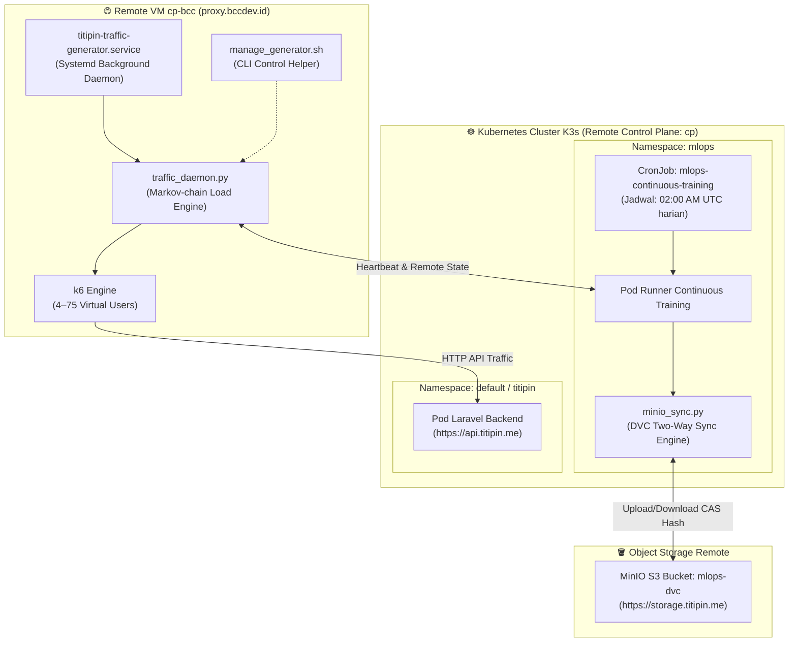

# 🌐 Panduan Lengkap Otomasi Remote VM & Klaster Kubernetes

Dokumen ini mencatat seluruh skrip, konfigurasi service, dan alur kerja otomatis yang berjalan pada **Remote VM eksternal** dan **Klaster Kubernetes (K3s)**, beserta panduan pengelolaan dan sanitasi kredensial keamanan.

---

## 🏗️ 1. Peta Topologi Otomasi Infrastruktur



---

## 💻 2. Otomasi pada Remote VM `cp-bcc` (`proxy.bccdev.id`)

### A. Lokasi Berkas di VM:
* **Direktori Kerja:** `/home/dev/titipin-traffic-generator/`
* **File Service Systemd:** `/etc/systemd/system/titipin-traffic-generator.service`

### B. Daftar Berkas & Fungsinya (Semua Tersinkron di Repo):
| Nama File di VM | Lokasi di Repositori Git | Fungsi |
|---|---|---|
| `traffic_daemon.py` | [`workloads/load-generator/traffic_daemon.py`](../workloads/load-generator/traffic_daemon.py) | Engine utama generator beban multi-state (Markov-chain) 24/7 dan polling heartbeat ke inference API. |
| `manage_generator.sh` | [`workloads/load-generator/manage_generator.sh`](../workloads/load-generator/manage_generator.sh) | CLI helper untuk start, stop, restart, cek logs, dan trigger paksa lonjakan (*spike*/*idle*/*steady*). |
| `k6_scenario.js` | [`workloads/load-generator/k6_scenario.js`](../workloads/load-generator/k6_scenario.js) | Skenario k6 beban kerja penjelajahan katalog dan transaksi HTTP API `https://api.titipin.me`. |
| `titipin-traffic-generator.service` | [`workloads/load-generator/titipin-traffic-generator.service`](../workloads/load-generator/titipin-traffic-generator.service) | Unit file systemd untuk auto-start dan auto-restart saat VM booting. |
| `setup_vm.sh` | [`workloads/load-generator/setup_vm.sh`](../workloads/load-generator/setup_vm.sh) | Skrip instalasi otomatis dependensi (k6, python3) dan registrasi service pada VM baru. |

### C. Panduan Pengelolaan via SSH:
```bash
# 1. Masuk ke VM cp-bcc
ssh cp-bcc

# 2. Masuk ke direktori generator
cd ~/titipin-traffic-generator

# 3. Periksa status operasional service
./manage_generator.sh status

# 4. Pantau log pergerakan trafik real-time
./manage_generator.sh logs

# 5. Memicu lonjakan trafik seketika (Flash-sale Spike)
./manage_generator.sh trigger spike

# 6. Mengembalikan ke trafik normal
./manage_generator.sh trigger steady
```

---

## ☸️ 3. Otomasi In-Cluster & Sinkronisasi DVC ke MinIO S3

Pada klaster K3s, proses pengumpulan data (*ingestion*), pelatihan ulang (*continuous training*), dan sinkronisasi dataset ke MinIO S3 berjalan **100% otomatis**:

### A. Jadwal CronJob Continuous Training (`mlops-continuous-training`):
* **Jadwal:** Setiap hari pukul `02:00 UTC` (`09:00 WIB`).
* **Manifest di Repo:** [`infrastructure/kubernetes/mlops/08-continuous-training-cronjob.yaml`](../infrastructure/kubernetes/mlops/08-continuous-training-cronjob.yaml)
* **Eksekusi di dalam Kontainer:**
  ```bash
  python src/pipeline/continuous_training.py --force --minutes 1440
  ```

### B. Engine Sinkronisasi Dua Arah (`src/data/minio_sync.py`):
* Script: [`src/data/minio_sync.py`](../src/data/minio_sync.py)
* **Cara Kerja:**
  1. Meng-scrape telemetri time-series dari Prometheus klaster.
  2. Menyimpan file CSV di `data/raw/` dan `data/processed/`.
  3. Menghitung MD5 checksum tiap file dan mengunggahnya ke MinIO bucket `s3://mlops-dvc` pada format Content-Addressable Storage (CAS) DVC (`files/md5/{xx}/{hash}`).
  4. Memicu pelatihan LightGBM dan pendaftaran model `@champion` ke MLflow Registry.
  5. Memicu *zero-downtime hot reload* pada inference pod via HTTP endpoint `/model/reload`.

### C. Skrip Sinkronisasi Mandiri untuk Lingkungan Headless / VM:
Untuk menarik atau mengunggah data DVC di lingkungan headless tanpa interaksi manual:
* Script: [`scripts/sync_dvc_remote.sh`](../scripts/sync_dvc_remote.sh)
```bash
# Tarik data dari MinIO S3:
./scripts/sync_dvc_remote.sh pull

# Unggah data ke MinIO S3:
./scripts/sync_dvc_remote.sh push

# Periksa status:
./scripts/sync_dvc_remote.sh status
```

---

## 🔐 4. Kebijakan Isolasi & Sanitasi Kredensial (Zero Leakage)

Demi keamanan repositori publik, semua kredensial sensitif diisolasi dengan aturan ketat:

1. **Konfigurasi DVC MinIO:**
   * File `.dvc/config` (publik di Git): Hanya mencatat URL remote `s3://mlops-dvc` dan endpoint `https://storage.titipin.me`.
   * File `.dvc/config.local` (rahasia): Berisi access key dan secret key MinIO aktual. File ini **secara otomatis diabaikan (*strictly ignored*) oleh `.dvc/.gitignore`**.
   * File Template Aman: Disediakan berkas template [` .dvc/config.local.example`](../.dvc/config.local.example) yang aman di-commit ke Git.
2. **Kredensial Kubernetes Klaster:**
   * Di dalam klaster K3s, kontainer MLOps menggunakan RBAC ServiceAccount (`mlops-service-account`) yang mounted otomatis di `/var/run/secrets/kubernetes.io/serviceaccount/token`. Tidak ada static token yang tersimpan di repositori.
3. **Environment Secrets:**
   * File `.env.secrets` lokal diabaikan oleh root `.gitignore`.
