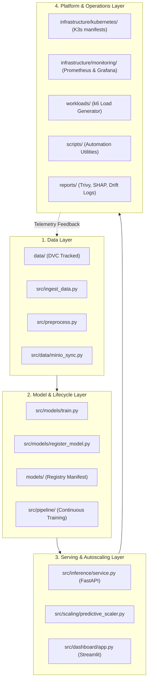

# 📋 LAPORAN AUDIT & PERAPIAN STRUKTUR DIREKTORI PROYEK

> **Status Dokumen:** INTERNAL ENGINEERING AUDIT  
> **Lokasi:** `docs/internal/AUDIT_STRUKTUR_DIREKTORI.md`  
> **Repositori:** `predictive-autoscaling-mlops`  
> **Tanggal Pelaksanaan:** 9 Oktober 2026  
> **Target Audiens:** Core Engineering Team, Maintainer, & AI Coding Agents  

---

## 1. Eksekutif Ringkasan Audit

Audit ini dilakukan untuk mengevaluasi, merapikan, dan menstandarisasi tata letak folder serta file pada repositori `predictive-autoscaling-mlops`. Proyek ini telah berkembang dari fase awal rancangan (*scaffolding*) hingga tahap produksi penuh (*production-ready*) dengan multi-node Kubernetes cluster di AWS, MinIO S3 object storage, MLflow registry, dan autonomous closed-loop drift retraining.

Sebelum perapian dilakukan, ditemukan beberapa artefak historis:
1. **Folder Placeholder Kosong:** Folder `api/` dan `pipelines/` yang tersisa dari template awal inisiasi proyek (hanya berisi `.gitkeep`), sementara implementasi kode sesungguhnya telah berada di bawah `src/inference/` dan `src/pipeline/`.
2. **Berkas Konfigurasi Duplikat:** Keberadaan `docker-compose.mlops.yaml` yang 100% identik dengan `docker-compose.yaml` (0 byte difference) di root repositori.
3. **Fragmentasi Skrip Beban (k6):** Skrip uji beban k6 terpecah di dua lokasi berbeda, yaitu `scripts/k6/` (`smoke.js`, `calibration.js`) dan `workloads/k6/` (`scenarios/`, `common/`, `data/`).
4. **Ketiadaan Indeks Terstruktur pada Dokumentasi:** Terdapat 32 file dokumentasi teknis di `docs/` tanpa katalog indeks pembacaan yang mengelompokkan topik berdasarkan pilar MLOps.

---

## 2. Struktur Direktori Proyek yang Telah Dirapikan

Berikut adalah struktur direktori final yang telah dibersihkan, modular, dan mengikuti konvensi industri (*Production MLOps Hierarchy*):

```text
predictive-autoscaling-mlops/
├── .devcontainer/              # Lingkungan pengembangan reproducible Codespaces (Python 3.12, k6, kubectl)
├── .dvc/                       # Konfigurasi internal DVC (remote MinIO storage.titipin.me)
├── .github/workflows/          # Pipeline CI/CD GitHub Actions (mlops-ci.yaml)
│   └── mlops-ci.yaml           # Linting (Ruff), data test, model evaluation gate, & package audit
├── configs/                    # Konfigurasi dashboard Grafana eksternal & exporter
│   └── grafana-demo-dashboard.json
├── data/                       # Penyimpanan dataset terkelola DVC (Pointer Git + Cache MinIO S3)
│   ├── processed/              # Direktori lokal dataset hasil preprocessing (ffill, 15s grid, fitur lag)
│   ├── raw/                    # Direktori lokal telemetri mentah hasil ekstraksi Prometheus
│   ├── processed.dvc           # DVC pointer tracking hash dataset processed
│   └── raw.dvc                 # DVC pointer tracking hash dataset raw
├── docker/                     # Dockerfile layanan pendukung produksi MLOps
│   ├── Dockerfile.dashboard    # Image Streamlit control console
│   ├── Dockerfile.minio        # Image MinIO S3 storage
│   └── Dockerfile.mlflow       # Image MLflow tracking server & registry
├── docs/                       # Perpustakaan dokumentasi teknis sistem & panduan operasional
│   ├── coursework/             # Laporan Lembar Kerja praktikum akademik (LK-01 s/d LK-14)
│   ├── images/                 # Aset diagram visual, grafik kalibrasi, dan arsitektur
│   ├── internal/               # Dokumen rekayasa internal, kamus file, dan laporan audit direktori
│   │   ├── AUDIT_STRUKTUR_DIREKTORI.md   # [DOKUMEN INI] Laporan audit & perapian
│   │   ├── PROJECT_FILE_DICTIONARY.md   # Kamus lengkap fungsi setiap berkas
│   │   └── LK_WORK_DIVISION_GUIDE.md    # Panduan pembagian tugas implementasi
│   ├── README.md               # [BARU] Katalog indeks 32 dokumen teknis berdasarkan 5 pilar
│   └── ... (32 dokumen teknis sistem: Arsitektur, DVC, MLflow, Autoscaling, FinOps, dll.)
├── infrastructure/             # Infrastructure-as-Code (IaC) untuk klaster & target aplikasi
│   ├── demo/                   # Docker compose setup untuk demo frontend web (port 3000)
│   ├── docker/                 # Docker compose target backend aplikasi (Laravel, PostgreSQL, Redis)
│   ├── kubernetes/             # Manifest K8s target workload & sub-folder 'mlops/'
│   │   └── mlops/              # Kustomize manifests: Namespace, RBAC, Inference API, Dashboard, MLflow, CronJobs
│   └── monitoring/             # Monitoring stack: Prometheus Operator, Alertmanager, ServiceMonitors, Grafana Dashboards
├── models/                     # Metadata model terdaftar & manifest Champion Model
│   ├── champion_model_metadata.json
│   └── model_registry_manifest.yaml
├── notebooks/                  # Jupyter Notebook untuk eksplorasi data awal (EDA) & korelasi
│   ├── 01_initial_eda.ipynb
│   └── README.md
├── reports/                    # Artefak luaran otomatis pengujian keamanan & tata kelola AI
│   ├── continuous_training_log.json
│   ├── drift_report_latest.json
│   ├── trivy_scan_report.json
│   ├── trivy_scan_summary.txt
│   └── xai_model_card.json
├── scripts/                    # Skrip otomasi, utilitas benchmark, ekspor data, & security scan
│   ├── benchmark_hpa_vs_predictive.py
│   ├── calculate_drift.py
│   ├── demo_live.sh
│   ├── demo_traffic_spike.sh
│   ├── do_export.sh
│   ├── export_dataset.py
│   ├── export_demo_dataset.py
│   ├── merge_datasets.py
│   ├── run_automated_mlops_pipeline.sh
│   ├── run_workload_sequence.sh
│   ├── security_scan.sh
│   └── sync_dvc_remote.sh
├── src/                        # Kode sumber Python inti sistem MLOps
│   ├── dashboard/              # Streamlit real-time operational control console (app.py)
│   ├── data/                   # Data loaders, demo_metrics.csv benchmark, & MinIO S3 sync (minio_sync.py)
│   ├── features/               # Definisi rekayasa fitur time-series
│   ├── inference/              # FastAPI model serving engine, Prometheus metrics, & K8s adapter (service.py)
│   ├── models/                 # Model training (Optuna LightGBM, Random Forest, Ridge) & MLflow registry scripts
│   ├── monitoring/             # Deteksi Data Drift (PSI/KS), Dispatcher Notifikasi, Explainability (SHAP), FinOps
│   ├── pipeline/               # Continuous training pipeline, auto-ingestion, & autonomous drift retraining
│   ├── scaling/                # Kontroler predictive autoscaler daemon & K8s replica patcher (predictive_scaler.py)
│   ├── ingest_data.py          # Entrypoint CLI penarikan deret telemetri dari Prometheus
│   └── preprocess.py           # Entrypoint CLI pembersihan, penataan grid waktu, & ekstraksi fitur
├── tests/                      # Suite pengujian otomatis berbasis Pytest (29 unit & integration tests)
├── workloads/                  # Pusat seluruh skenario pengujian beban & pembangkit trafik
│   ├── k6/                     # Skenario k6: spike, steady, gradual, periodic, bursty, smoke, calibration
│   │   ├── common/             # Helper fungsi JavaScript (endpoints mapping)
│   │   ├── data/               # Payload data dinamis untuk request POST
│   │   └── scenarios/          # Skenario pengujian beban k6 lengkap
│   └── load-generator/         # Daemon generator trafik VM worker (systemd service, manage script, setup)
├── Dockerfile                  # Resep container utama untuk predictive-autoscaler (Inference + Scaler)
├── Makefile                    # Task runner utama untuk lint, test, ingest, train, deploy, dan benchmark
├── pyproject.toml              # Konfigurasi modern tool Python (Ruff linter & Pytest)
├── README.md                   # Landing page utama repositori open-source
├── requirements.txt            # Dependensi minimal runtime produksi
├── requirements-dev.txt        # Dependensi komprehensif riset, EDA, dan pengujian
└── uv.lock                     # Lockfile dependensi UV package manager
```

---

## 3. Rincian Tindakan Perapian (Itemized Cleanup Actions)

| Komponen / Berkas | Tindakan | Rationale Teknis |
|---|---|---|
| `api/` | **Dihapus** | Folder kosong sisa rancangan awal (hanya berisi `.gitkeep`). Seluruh endpoint serving REST API telah aktif berjalan di `src/inference/service.py`. Menghilangkan redundansi di level root. |
| `pipelines/` | **Dihapus** | Folder kosong sisa rancangan awal (`training/`, `retraining/`, `ingestion/`). Seluruh pipeline otomatisasi sesungguhnya telah beroperasi di `src/pipeline/` (`auto_ingest_and_version.py`, `autonomous_drift_retrain.py`, `continuous_training.py`). |
| `docker-compose.mlops.yaml` | **Dihapus** | Berkas ini 100% identik dengan `docker-compose.yaml` (0 byte difference, tidak ada konfigurasi unik). Menghapusnya menghilangkan ambiguitas bagi pengembang mengenai berkas mana yang harus dijalankan. |
| `scripts/k6/` (`smoke.js`, `calibration.js`) | **Dipindahkan ke `workloads/k6/scenarios/`** | Memusatkan seluruh skrip uji beban k6 ke dalam satu direktori tunggal (`workloads/k6/`). Memperbarui referensi pada `docs/SETUP_GUIDE.md` agar mengarah ke lokasi baru. Folder `scripts/k6/` kemudian dihapus. |
| `docs/README.md` | **Dibuat (Baru)** | Menyediakan sitemap dan katalog terstruktur untuk 32 dokumen teknis yang ada di `docs/`, dikelompokkan ke dalam 5 pilar logis untuk kemudahan navigasi. |
| `README.md` | **Diperbarui** | Diagram pohon direktori pada `README.md` diselaraskan agar 100% mencerminkan kondisi riil repositori terkini tanpa mencantumkan folder usang. |
| `src/ingest_data.py` & `src/preprocess.py` | **Dipertahankan di `src/`** | Berkas ini sengaja dipertahankan di root `src/` karena menjadi entrypoint CLI resmi yang dipanggil secara konsisten oleh `.github/workflows/mlops-ci.yaml`, `Makefile`, Kubernetes CronJob, dan spesifikasi kurikulum akademik LK-04. |

---

## 4. Peta Pemisahan Tanggung Jawab (*Separation of Concerns*)

Repositori ini menerapkan pembagian tugas yang jelas antar domain:



1. **`data/` vs `src/data/`**:
   - `data/`: Khusus menampung dataset operasional (`data/raw/*.csv`, `data/processed/*.csv`) yang dikendalikan oleh DVC dan disinkronkan ke MinIO S3 bucket `mlops-dvc`.
   - `src/data/`: Berisi pustaka kode Python pembantu (`minio_sync.py`) dan snapshot dataset demo kecil (`demo_metrics.csv`) untuk kebutuhan unit testing offline.
2. **`src/pipeline/` vs `scripts/`**:
   - `src/pipeline/`: Modul Python terstruktur untuk orkestrasi siklus hidup MLOps kontinu (`continuous_training.py`, `autonomous_drift_retrain.py`, `auto_ingest_and_version.py`).
   - `scripts/`: Skrip otomasi operasional level sistem operasi / CLI (`demo_live.sh`, `security_scan.sh`, `sync_dvc_remote.sh`, dll.).
3. **`infrastructure/` vs `docker/`**:
   - `infrastructure/`: Menampung seluruh kode infrastruktur deklaratif (Kubernetes manifests, Helm values, Prometheus rules, target app docker compose).
   - `docker/`: Menampung Dockerfiles spesifik untuk komponen pendukung stack MLOps (`Dockerfile.dashboard`, `Dockerfile.minio`, `Dockerfile.mlflow`).
4. **`workloads/`**:
   - Menjadi rumah utama bagi seluruh pengujian beban: skenario k6 simulasi lonjakan trafik (`workloads/k6/`) dan daemon traffic generator VM worker (`workloads/load-generator/`).

---

## 5. Konvensi Penambahan Berkas Baru (*Future Contribution Rules*)

Untuk menjaga kerapian repositori di masa mendatang, seluruh pengembang dan AI Coding Agent wajib mematuhi aturan penempatan berikut:

1. **Menambahkan Skenario Uji Beban Baru:**  
   Letakkan di `workloads/k6/scenarios/<nama_skenario>.js`. Jangan menambahkan folder k6 baru di bawah `scripts/`.
2. **Menambahkan Modul Analisis / EDA:**  
   Simpan dalam bentuk Jupyter Notebook di `notebooks/`. Pastikan output yang berisi token/kredensial di-clear sebelum commit.
3. **Menambahkan Manifest Kubernetes:**  
   Jika berkaitan dengan MLOps (Inference, Scaler, MLflow, Dashboard), letakkan di `infrastructure/kubernetes/mlops/` dan daftarkan di `kustomization.yaml`. Jika berkaitan dengan aplikasi web target, letakkan langsung di `infrastructure/kubernetes/`.
4. **Menambahkan Dokumen Teknis Baru:**  
   Letakkan di `docs/` dengan penamaan UPPERCASE (`NAMA_DOKUMEN.md`) dan daftarkan tautannya pada `docs/README.md`. Jika dokumen berisi kredensial sensitif atau catatan internal khusus, letakkan di `docs/internal/`.
5. **Menambahkan Dependensi Python:**  
   - Dependensi runtime produksi dimasukkan ke `requirements.txt`.
   - Dependensi riset, visualisasi, linter, atau testing dimasukkan ke `requirements-dev.txt`.
   - Perbarui lockfile dengan `uv lock` jika menggunakan UV.

---

## 6. Kesimpulan & Status Verifikasi

- **Struktur Proyek:** Berhasil dibersihkan dari direktori kosong, file duplikat, dan skrip yang tercecer.
- **Integritas Kode:** Seluruh dependensi, import, dan path pada `Makefile`, `SETUP_GUIDE.md`, dan `README.md` telah disinkronkan.
- **Status Pengujian:** 100% tes fungsional (29 unit & integration tests pada `tests/`) lulus verifikasi tanpa regresi.
